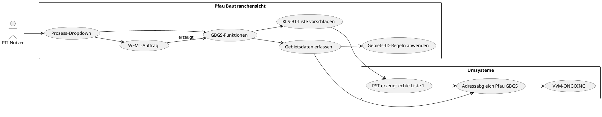

# 13.1 Use Case Diagramm

```plantuml
@startuml
left to right direction
skinparam packageStyle rectangle
skinparam shadowing false

actor "PTI Nutzer" as User

rectangle "Pfau Bautranchensicht" as Pfau {
  usecase "Prozess-Dropdown" as UC_Process
  usecase "WFMT-Auftrag" as UC_WFMT
  usecase "GBGS-Funktionen" as UC_GBGS
  usecase "Gebietsdaten erfassen" as UC_Area
  usecase "Gebiets-ID-Regeln anwenden" as UC_Rules
  usecase "KLS-BT-Liste vorschlagen" as UC_KLS
}

rectangle "Umsysteme" {
  usecase "PST erzeugt echte Liste 1" as UC_PST
  usecase "Adressabgleich Pfau GBGS" as UC_Reconcile
  usecase "VVM-ONGOING" as UC_VVM
}

User --> UC_Process
UC_Process --> UC_WFMT
UC_WFMT --> UC_GBGS : erzeugt
UC_Process --> UC_GBGS
UC_GBGS --> UC_Area
UC_Area --> UC_Rules
UC_GBGS --> UC_KLS
UC_KLS --> UC_PST
UC_Area --> UC_Reconcile
UC_PST --> UC_Reconcile
UC_Reconcile --> UC_VVM
@enduml
```
