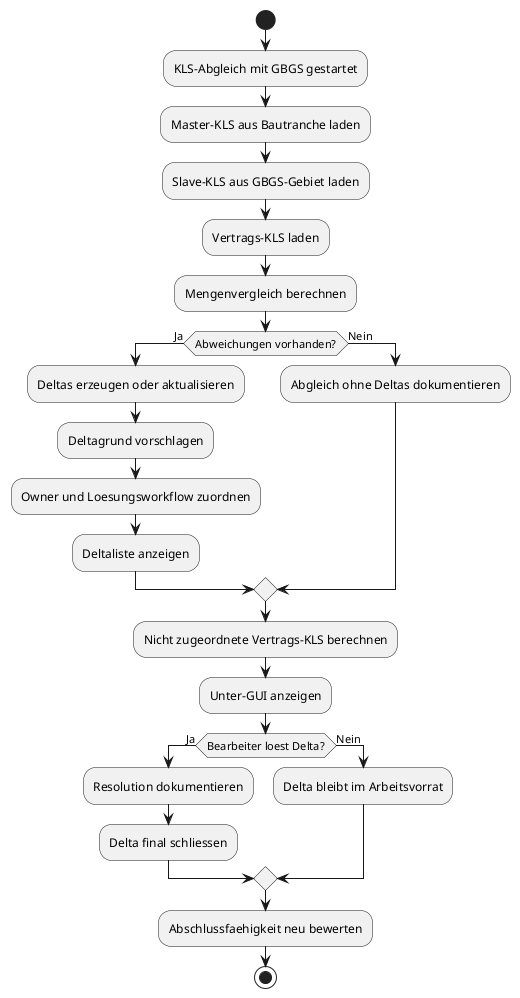

# 13.10 Aktivitaetsdiagramm: KLS-Abgleich und Deltafuehrung

```plantuml
@startuml
skinparam shadowing false

start
:KLS-Abgleich mit GBGS gestartet;
:Master-KLS aus Bautranche laden;
:Slave-KLS aus GBGS-Gebiet laden;
:Vertrags-KLS laden;
:Mengenvergleich berechnen;

if (Abweichungen vorhanden?) then (Ja)
  :Deltas erzeugen oder aktualisieren;
  :Deltagrund vorschlagen;
  :Owner und Loesungsworkflow zuordnen;
  :Deltaliste anzeigen;
else (Nein)
  :Abgleich ohne Deltas dokumentieren;
endif

:Nicht zugeordnete Vertrags-KLS berechnen;
:Unter-GUI anzeigen;

if (Bearbeiter loest Delta?) then (Ja)
  :Resolution dokumentieren;
  :Delta final schliessen;
else (Nein)
  :Delta bleibt im Arbeitsvorrat;
endif

:Abschlussfaehigkeit neu bewerten;
stop
@enduml
```
