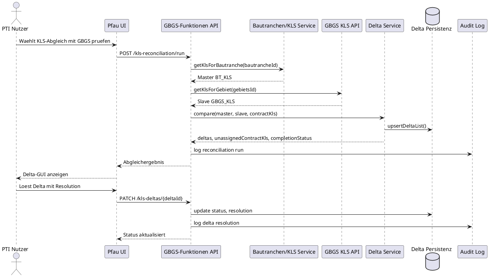

# 13.11 Sequenzdiagramm: KLS-Abgleich

```plantuml
@startuml
skinparam shadowing false

actor "PTI Nutzer" as User
participant "Pfau UI" as UI
participant "GBGS-Funktionen API" as API
participant "Bautranchen/KLS Service" as BT
participant "GBGS KLS API" as GBGS
participant "Delta Service" as DELTA
database "Delta Persistenz" as DB
participant "Audit Log" as AUD

User -> UI : Waehlt KLS-Abgleich mit GBGS pruefen
UI -> API : POST /kls-reconciliation/run
API -> BT : getKlsForBautranche(bautrancheId)
BT --> API : Master BT_KLS
API -> GBGS : getKlsForGebiet(gebietsId)
GBGS --> API : Slave GBGS_KLS
API -> DELTA : compare(master, slave, contractKls)
DELTA -> DB : upsertDeltaList()
DELTA --> API : deltas, unassignedContractKls, completionStatus
API -> AUD : log reconciliation run
API --> UI : Abgleichergebnis
UI --> User : Delta-GUI anzeigen

User -> UI : Loest Delta mit Resolution
UI -> API : PATCH /kls-deltas/{deltaId}
API -> DB : update status, resolution
API -> AUD : log delta resolution
API --> UI : Status aktualisiert
@enduml
```
