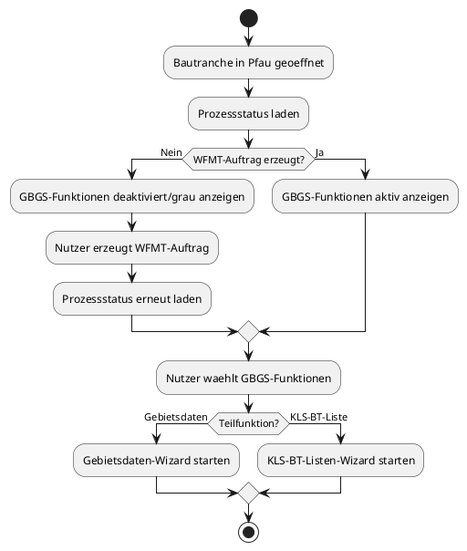

# 13.2 Aktivitaetsdiagramm: Einstieg und Funktionsauswahl

```plantuml
@startuml
skinparam shadowing false

start
:Bautranche in Pfau geoeffnet;
:Prozessstatus laden;

if (WFMT-Auftrag erzeugt?) then (Nein)
  :GBGS-Funktionen deaktiviert/grau anzeigen;
  :Nutzer erzeugt WFMT-Auftrag;
  :Prozessstatus erneut laden;
else (Ja)
  :GBGS-Funktionen aktiv anzeigen;
endif

:Nutzer waehlt GBGS-Funktionen;

if (Teilfunktion?) then (Gebietsdaten)
  :Gebietsdaten-Wizard starten;
else (KLS-BT-Liste)
  :KLS-BT-Listen-Wizard starten;
endif

stop
@enduml
```
