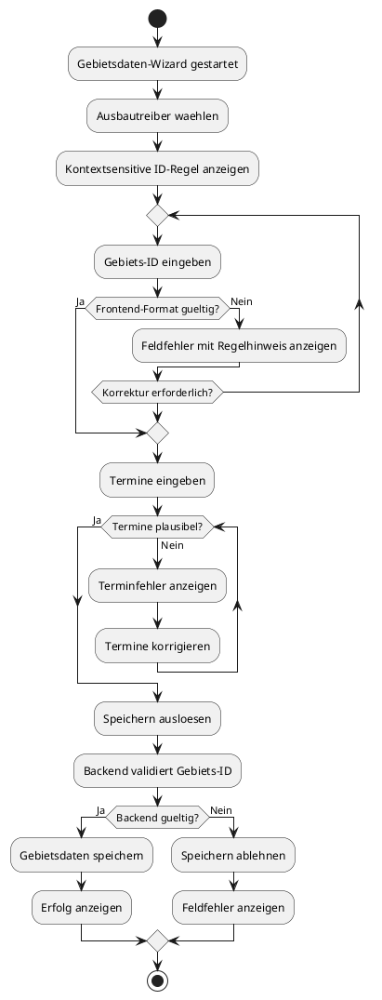

# 13.3 Aktivitaetsdiagramm: Gebietsdaten

```plantuml
@startuml
skinparam shadowing false

start
:Gebietsdaten-Wizard gestartet;
:Ausbautreiber waehlen;
:Kontextsensitive ID-Regel anzeigen;

repeat
  :Gebiets-ID eingeben;
  if (Frontend-Format gueltig?) then (Ja)
    break
  else (Nein)
    :Feldfehler mit Regelhinweis anzeigen;
  endif
repeat while (Korrektur erforderlich?)

:Termine eingeben;

while (Termine plausibel?) is (Nein)
  :Terminfehler anzeigen;
  :Termine korrigieren;
endwhile (Ja)

:Speichern ausloesen;
:Backend validiert Gebiets-ID;

if (Backend gueltig?) then (Ja)
  :Gebietsdaten speichern;
  :Erfolg anzeigen;
else (Nein)
  :Speichern ablehnen;
  :Feldfehler anzeigen;
endif

stop
@enduml
```
