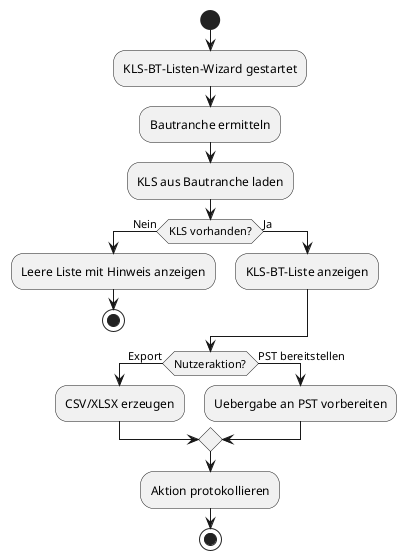

# 13.4 Aktivitaetsdiagramm: KLS-BT-Liste

```plantuml
@startuml
skinparam shadowing false

start
:KLS-BT-Listen-Wizard gestartet;
:Bautranche ermitteln;
:KLS aus Bautranche laden;

if (KLS vorhanden?) then (Nein)
  :Leere Liste mit Hinweis anzeigen;
  stop
else (Ja)
  :KLS-BT-Liste anzeigen;
endif

if (Nutzeraktion?) then (Export)
  :CSV/XLSX erzeugen;
else (PST bereitstellen)
  :Uebergabe an PST vorbereiten;
endif

:Aktion protokollieren;
stop
@enduml
```
