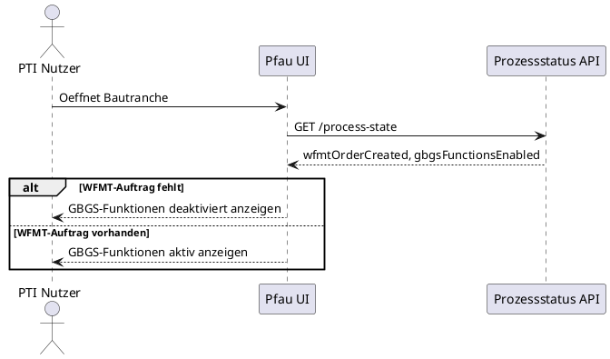

# 13.5 Sequenzdiagramm: Prozess-Dropdown

```plantuml
@startuml
skinparam shadowing false

actor "PTI Nutzer" as User
participant "Pfau UI" as UI
participant "Prozessstatus API" as PROC

User -> UI : Oeffnet Bautranche
UI -> PROC : GET /process-state
PROC --> UI : wfmtOrderCreated, gbgsFunctionsEnabled

alt WFMT-Auftrag fehlt
  UI --> User : GBGS-Funktionen deaktiviert anzeigen
else WFMT-Auftrag vorhanden
  UI --> User : GBGS-Funktionen aktiv anzeigen
end
@enduml
```
