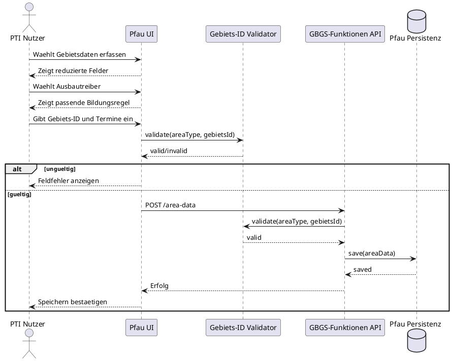

# 13.6 Sequenzdiagramm: Gebietsdaten speichern

```plantuml
@startuml
skinparam shadowing false

actor "PTI Nutzer" as User
participant "Pfau UI" as UI
participant "Gebiets-ID Validator" as VAL
participant "GBGS-Funktionen API" as API
database "Pfau Persistenz" as DB

User -> UI : Waehlt Gebietsdaten erfassen
UI --> User : Zeigt reduzierte Felder
User -> UI : Waehlt Ausbautreiber
UI --> User : Zeigt passende Bildungsregel
User -> UI : Gibt Gebiets-ID und Termine ein
UI -> VAL : validate(areaType, gebietsId)
VAL --> UI : valid/invalid

alt ungueltig
  UI --> User : Feldfehler anzeigen
else gueltig
  UI -> API : POST /area-data
  API -> VAL : validate(areaType, gebietsId)
  VAL --> API : valid
  API -> DB : save(areaData)
  DB --> API : saved
  API --> UI : Erfolg
  UI --> User : Speichern bestaetigen
end
@enduml
```
