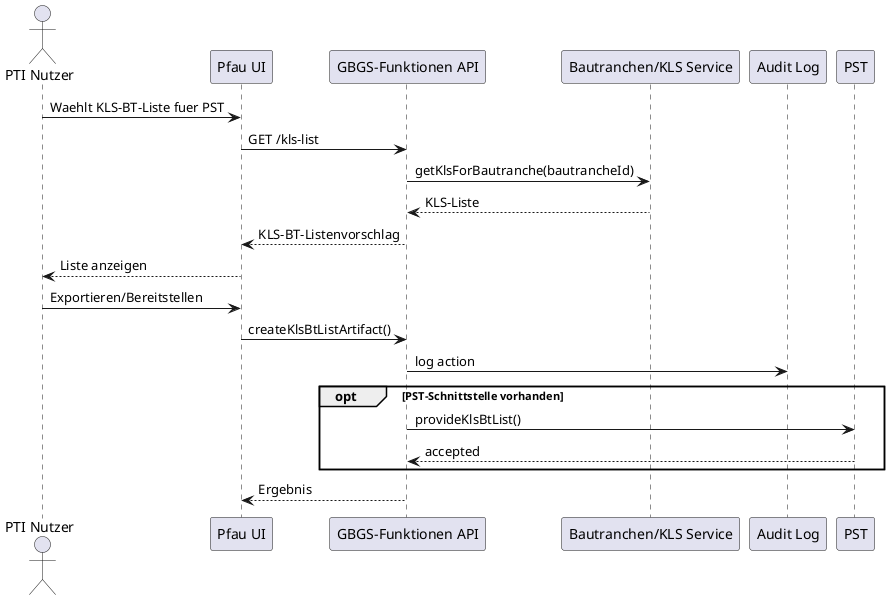

# 13.7 Sequenzdiagramm: KLS-BT-Liste

```plantuml
@startuml
skinparam shadowing false

actor "PTI Nutzer" as User
participant "Pfau UI" as UI
participant "GBGS-Funktionen API" as API
participant "Bautranchen/KLS Service" as KLS
participant "Audit Log" as AUD
participant "PST" as PST

User -> UI : Waehlt KLS-BT-Liste fuer PST
UI -> API : GET /kls-list
API -> KLS : getKlsForBautranche(bautrancheId)
KLS --> API : KLS-Liste
API --> UI : KLS-BT-Listenvorschlag
UI --> User : Liste anzeigen
User -> UI : Exportieren/Bereitstellen
UI -> API : createKlsBtListArtifact()
API -> AUD : log action

opt PST-Schnittstelle vorhanden
  API -> PST : provideKlsBtList()
  PST --> API : accepted
end

API --> UI : Ergebnis
@enduml
```
