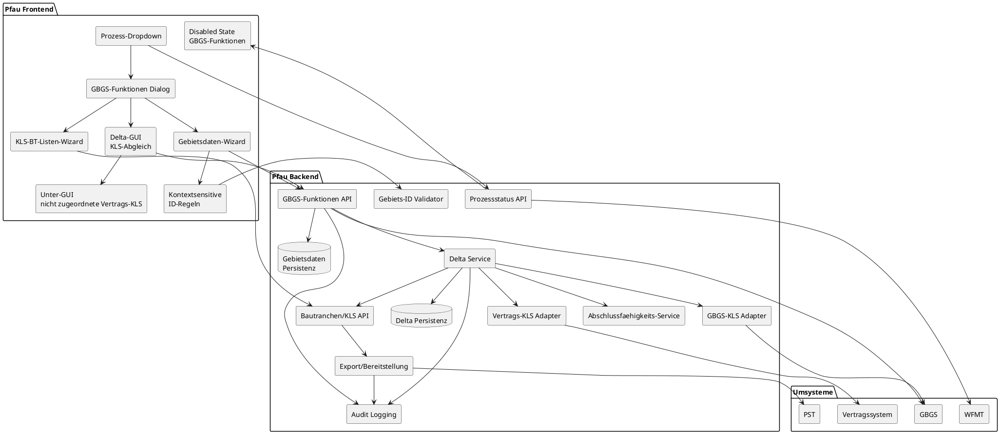

# 13.8 Komponentendiagramm

```plantuml
@startuml
skinparam componentStyle rectangle
skinparam shadowing false

package "Pfau Frontend" {
  [Prozess-Dropdown] as PD
  [Disabled State\nGBGS-Funktionen] as DIS
  [GBGS-Funktionen Dialog] as MOD
  [Gebietsdaten-Wizard] as AREA
  [Kontextsensitive\nID-Regeln] as RULE
  [KLS-BT-Listen-Wizard] as KLSUI
  [Delta-GUI\nKLS-Abgleich] as DELTAUI
  [Unter-GUI\nnicht zugeordnete Vertrags-KLS] as UNASSIGNEDUI
}

package "Pfau Backend" {
  [Prozessstatus API] as PROC
  [GBGS-Funktionen API] as FAPI
  [Gebiets-ID Validator] as VALID
  database "Gebietsdaten\nPersistenz" as DATA
  [Bautranchen/KLS API] as KLSAPI
  [GBGS-KLS Adapter] as GBGSKLS
  [Delta Service] as DELTASVC
  database "Delta Persistenz" as DELTADB
  [Vertrags-KLS Adapter] as CONTRACT
  [Abschlussfaehigkeits-Service] as COMPLETE
  [Export/Bereitstellung] as EXPORT
  [Audit Logging] as AUD
}

package "Umsysteme" {
  [WFMT] as WFMT
  [PST] as PST
  [GBGS] as GBGS
  [Vertragssystem] as CONTRACTSYS
}

PD --> PROC
PROC --> WFMT
PROC --> DIS
PD --> MOD
MOD --> AREA
AREA --> RULE
RULE --> VALID
AREA --> FAPI
FAPI --> DATA
MOD --> KLSUI
KLSUI --> KLSAPI
MOD --> DELTAUI
DELTAUI --> FAPI
DELTAUI --> UNASSIGNEDUI
KLSAPI --> EXPORT
EXPORT --> PST
FAPI --> DELTASVC
DELTASVC --> KLSAPI
DELTASVC --> GBGSKLS
DELTASVC --> CONTRACT
DELTASVC --> DELTADB
DELTASVC --> COMPLETE
GBGSKLS --> GBGS
CONTRACT --> CONTRACTSYS
FAPI --> AUD
DELTASVC --> AUD
EXPORT --> AUD
FAPI --> GBGS
@enduml
```
