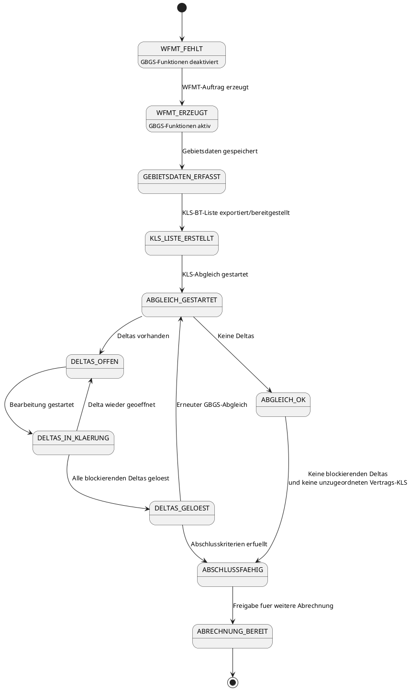

# 13.9 Statusmodell

```plantuml
@startuml
skinparam shadowing false

[*] --> WFMT_FEHLT

WFMT_FEHLT : GBGS-Funktionen deaktiviert
WFMT_FEHLT --> WFMT_ERZEUGT : WFMT-Auftrag erzeugt

WFMT_ERZEUGT : GBGS-Funktionen aktiv
WFMT_ERZEUGT --> GEBIETSDATEN_ERFASST : Gebietsdaten gespeichert

GEBIETSDATEN_ERFASST --> KLS_LISTE_ERSTELLT : KLS-BT-Liste exportiert/bereitgestellt
KLS_LISTE_ERSTELLT --> ABGLEICH_GESTARTET : KLS-Abgleich gestartet

ABGLEICH_GESTARTET --> DELTAS_OFFEN : Deltas vorhanden
ABGLEICH_GESTARTET --> ABGLEICH_OK : Keine Deltas

DELTAS_OFFEN --> DELTAS_IN_KLAERUNG : Bearbeitung gestartet
DELTAS_IN_KLAERUNG --> DELTAS_OFFEN : Delta wieder geoeffnet
DELTAS_IN_KLAERUNG --> DELTAS_GELOEST : Alle blockierenden Deltas geloest
DELTAS_GELOEST --> ABGLEICH_GESTARTET : Erneuter GBGS-Abgleich

ABGLEICH_OK --> ABSCHLUSSFAEHIG : Keine blockierenden Deltas\nund keine unzugeordneten Vertrags-KLS
DELTAS_GELOEST --> ABSCHLUSSFAEHIG : Abschlusskriterien erfuellt
ABSCHLUSSFAEHIG --> ABRECHNUNG_BEREIT : Freigabe fuer weitere Abrechnung

ABRECHNUNG_BEREIT --> [*]
@enduml
```
