# PlantUML-Diagramme: Adressabgleich Pfau GBGS

Diese Dateien enthalten die UML-Diagramme aus Kapitel 13 des Solutiondesigns im PlantUML-Markdown-Format.

Jede Datei enthaelt einen fenced Codeblock:

```text

```plantuml
@startuml
...
@enduml
```

```

Die Inhalte koennen in Confluence in ein PlantUML-Makro kopiert werden.
