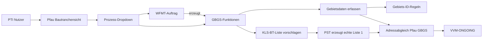
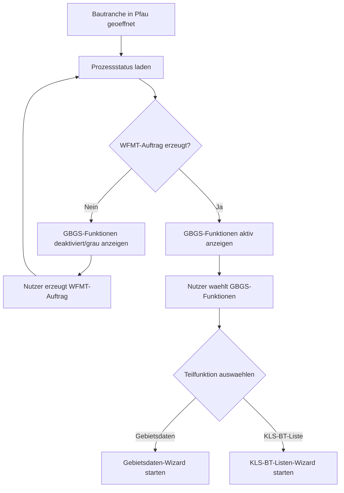
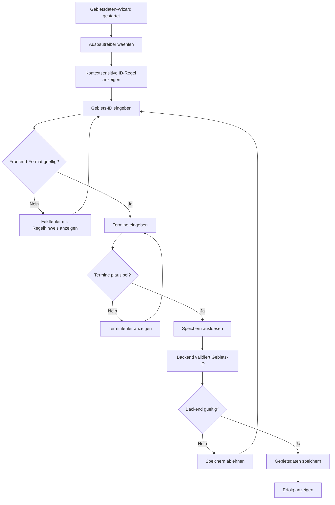
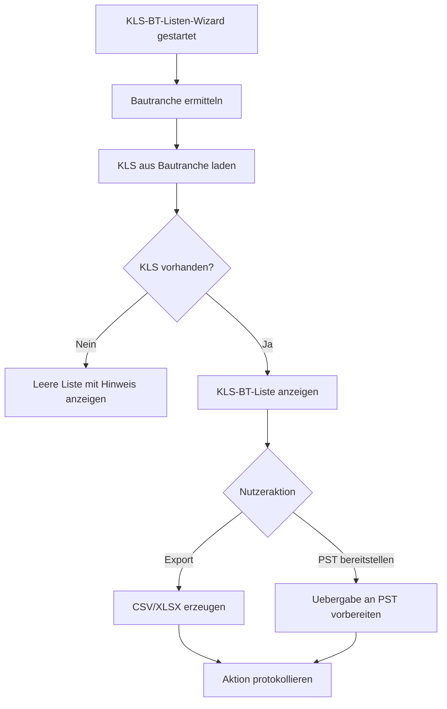
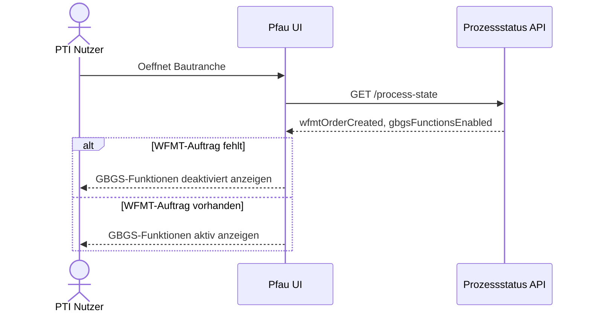
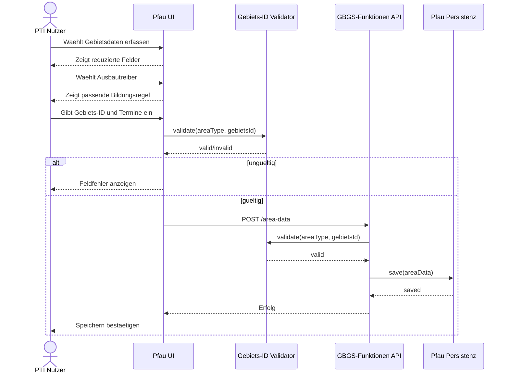
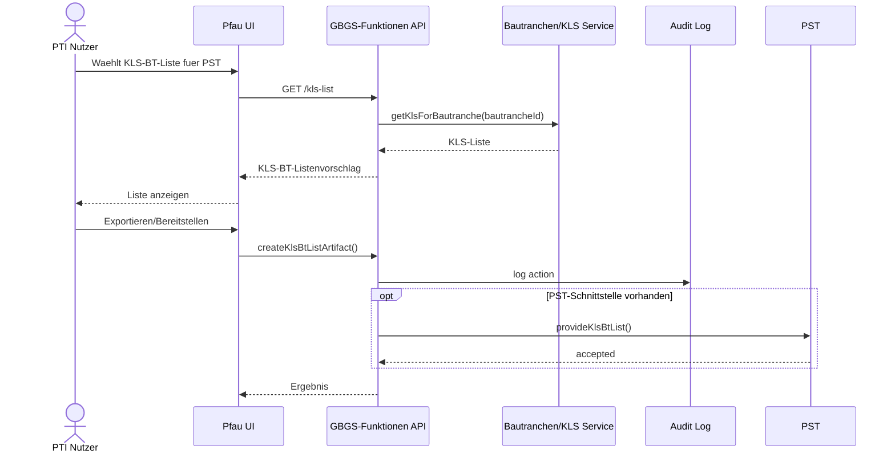
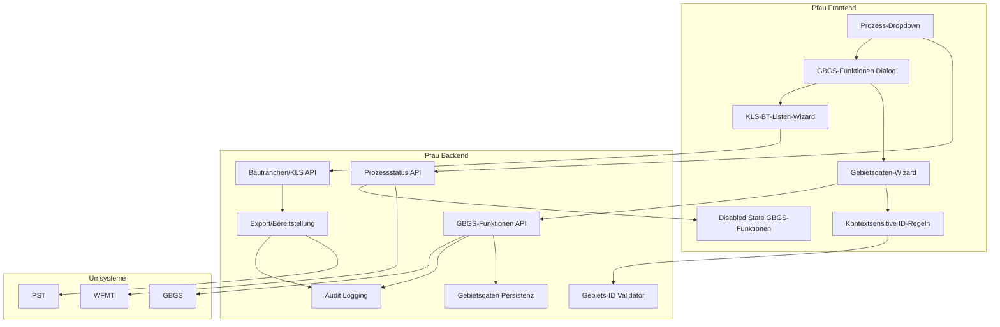
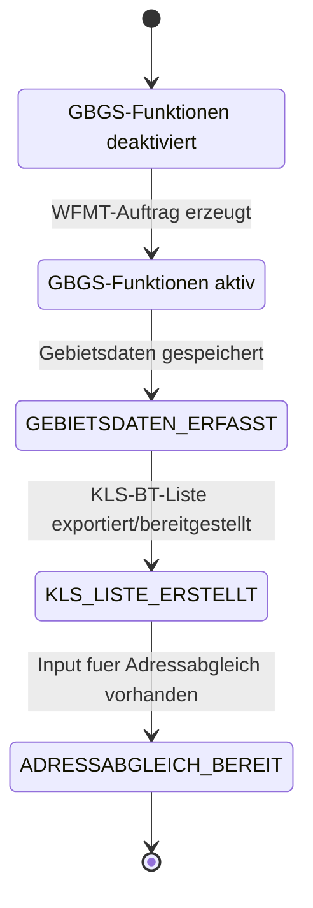

# Solutiondesign: Adressabgleich Pfau GBGS

## 1. Management Summary

Dieses Dokument beschreibt das vollstaendige Solutiondesign fuer den Use Case `Adressabgleich Pfau GBGS`.

Der Use Case wird in der Pfau-Bautranchensicht angeboten und dient dazu, die fuer den Adressabgleich relevanten Gebietsdaten strukturiert zu erfassen, die Gebiets-ID nach Ausbautreiber zu validieren und fuer die Weiterverarbeitung in PST eine KLS-BT-Liste vorzuschlagen.

Die aktuelle Designdiskussion hat drei zentrale Entscheidungen ergeben:

1. Die Gebietserfassung in Pfau ist keine vollstaendige GBGS-Gebietsanlage mehr.
2. Die bisherige VVM-Importlisten-Funktion wird auf einen KLS-BT-Listenvorschlag fuer PST reduziert.
3. Der Einstieg erfolgt nicht ueber einen separaten Button, sondern ueber das Prozess-Dropdown in der Pfau-Bautranchensicht.

Der neue Prozess-Dropdown-Eintrag heisst:

```text
GBGS-Funktionen
```

Er wird unterhalb von `WFMT-Auftrag` angezeigt und ist erst aktiv, wenn der WFMT-Auftrag erzeugt wurde. Vorher ist der Eintrag sichtbar, aber deaktiviert/grau.

## 2. Zielbild

Der PTI Nutzer arbeitet in der Pfau-Bautranchensicht. Sobald der WFMT-Auftrag erzeugt wurde, kann der Nutzer ueber das Prozess-Dropdown `GBGS-Funktionen` aufrufen.

Der Dialog `GBGS-Funktionen` bietet zwei fachliche Teilfunktionen:

| Funktion | Ziel |
| --- | --- |
| `Gebietsdaten fuer Adressabgleich erfassen` | Erfassung der minimal benoetigten Gebietsdaten und Validierung der Gebiets-ID |
| `KLS-BT-Liste fuer PST vorschlagen` | Bereitstellung des KLS-Anteils aus der Bautranche fuer die spaetere Liste-1-Erzeugung in PST |

Die Loesung entkoppelt damit klar:

- Pfau: Erfassung und Vorbereitung fuer den Adressabgleich.
- PST: Erzeugung der echten `Liste 1`.
- GBGS: Zielsystem bzw. Referenzkontext fuer Gebietsdaten und Adressabgleich.

## 3. Fachlicher Hintergrund

### 3.1 Pfau Bautranchensicht

Pfau zeigt Bautranchen mit Stammdaten, Adressen, Anlagen, Kommentaren und Prozessaktionen. Die neue Funktion soll in den bestehenden Prozesskontext integriert werden.

Der relevante Einstiegspunkt ist das Prozess-Dropdown rechts oben in der Bautranchensicht. Der Screenshot `GBGS Wizzard 1946 5` zeigt die neue Grund-GUI.

### 3.2 GBGS-Gebietsdaten

Die urspruengliche Annahme war, dass Pfau eine gefuehrte GBGS-Gebietsanlage abbildet. Nach der Designklaerung ist klar, dass fuer `Adressabgleich Pfau GBGS` nicht alle Felder benoetigt werden.

Pfau muss daher nur noch die Daten erfassen, die fuer den Adressabgleich relevant sind:

- Ausbautreiber bzw. Gebietstyp
- Gebiets-ID
- relevante Terminangaben

Nicht mehr erforderlich sind unter anderem Initiative, Gebietseigner, Regelwerk, Partnerdaten und CSV-Import.

### 3.3 KLS-Anteil der Liste 1

Die bisherige Funktion `VVM-Importliste erzeugen` soll nicht mehr die echte VVM-Importliste bzw. echte `Liste 1` erzeugen. Fuer diesen Use Case ist nur der KLS-Anteil relevant.

Pfau soll daher eine KLS-BT-Liste vorschlagen:

- Quelle: aktuelle Bautranche in Pfau
- Inhalt: KLS aus dieser Bautranche
- Ziel: Weiterverwendung in PST
- Nicht-Ziel: finale Liste-1-Erzeugung

## 4. Scope

### 4.1 Im Scope

Im Scope dieses Solutiondesigns sind:

- Anzeige von `GBGS-Funktionen` im Prozess-Dropdown.
- Aktivierung von `GBGS-Funktionen` erst nach erzeugtem WFMT-Auftrag.
- Dialog mit Auswahl der GBGS-Funktionen.
- Reduzierter Wizard zur Erfassung von Gebietsdaten fuer den Adressabgleich.
- Kontext-sensitive Gebiets-ID-Bildungsregeln fuer:
  - Deckungsluecke
  - GlasfaserPlus
  - Betreibermodelle
- Frontend- und Backend-Validierung der Gebiets-ID.
- Speicherung der reduzierten Gebietsdaten je Bautranche.
- Vorschlag einer KLS-BT-Liste aus den KLS der aktuellen Bautranche.
- Export oder technische Bereitstellung der KLS-BT-Liste fuer PST.
- Auditierbarkeit relevanter Nutzeraktionen.
- Jira-Arbeitspakete fuer IT-Umsetzung.

### 4.2 Nicht im Scope

Nicht im Scope sind:

- Vollstaendige GBGS-Gebietsanlage in Pfau.
- CSV-Import eines Giga-Gebiets aus Pfau nach GBGS.
- Nachbau der GBGS-Importmaske in Pfau.
- Erfassung von GBGS-Partnerdaten:
  - Mandant
  - Betreiber aktives Netz
  - Betreiber passives Netzwerk
  - ROP initial
  - ROP lokal
  - ROP Regelausbau
  - Beschwerdemanagement
- Erzeugung der echten `Liste 1` in Pfau.
- Ersatz von PST.
- Fachliche Klaerung der finalen DL-/GFP-ID-Regex, sofern diese noch nicht verbindlich vorliegt.

## 5. Rollen, Systeme und Verantwortlichkeiten

| Rolle/System | Verantwortung |
| --- | --- |
| PTI Nutzer | Startet Prozess in Pfau, erfasst Gebietsdaten, erzeugt KLS-BT-Listenvorschlag |
| Pfau Frontend | Darstellung Bautranchensicht, Prozess-Dropdown, Dialoge und Validierungshinweise |
| Pfau Backend | Prozessstatus, Persistenz, Gebiets-ID-Validierung, KLS-BT-Liste |
| WFMT | Prozessuale Vorbedingung fuer Aktivierung von `GBGS-Funktionen` |
| GBGS | Fachlicher Zielkontext fuer Gebiet und Adressabgleich |
| PST | Erzeugung der echten `Liste 1` auf Basis geeigneter Inputs |
| Audit/Logging | Nachvollziehbarkeit von Speicherung, Export und Fehlerfaellen |

## 6. Fachliche Anforderungen

### 6.1 Einstieg und Aktivierung

| ID | Anforderung |
| --- | --- |
| FA-01 | In der Bautranchensicht wird im Prozess-Dropdown unterhalb von `WFMT-Auftrag` ein neuer Eintrag `GBGS-Funktionen` angezeigt. |
| FA-02 | `GBGS-Funktionen` ist deaktiviert/grau, solange der WFMT-Auftrag noch nicht erzeugt wurde. |
| FA-03 | `GBGS-Funktionen` wird aktiv, sobald der WFMT-Auftrag erzeugt wurde. |
| FA-04 | Es wird kein separater Button fuer die Funktion angezeigt. |
| FA-05 | Die Aktivierung erfolgt serverseitig anhand eines Prozessstatus, nicht nur clientseitig. |

### 6.2 Gebietsdaten fuer Adressabgleich

| ID | Anforderung |
| --- | --- |
| FA-10 | Der Wizard erfasst nur die fuer den Adressabgleich benoetigten Gebietsdaten. |
| FA-11 | Nicht benoetigte GBGS-Felder werden nicht angezeigt. |
| FA-12 | Der Nutzer waehlt einen Ausbautreiber/Gebietstyp. |
| FA-13 | Die Gebiets-ID wird verpflichtend erfasst. |
| FA-14 | Die Bildungsregel der Gebiets-ID wird kontextsensitiv zum Ausbautreiber angezeigt. |
| FA-15 | Die Gebiets-ID wird im Frontend und Backend validiert. |
| FA-16 | Gueltige Gebietsdaten werden pro Bautranche gespeichert. |

### 6.3 KLS-BT-Liste fuer PST

| ID | Anforderung |
| --- | --- |
| FA-20 | Die bisherige VVM-Importlisten-Funktion wird fachlich in eine KLS-BT-Listenfunktion umgewandelt. |
| FA-21 | Pfau erzeugt nicht die echte `Liste 1`. |
| FA-22 | Pfau schlaegt nur KLS aus der aktuellen Bautranche vor. |
| FA-23 | Die KLS-BT-Liste ist als Input fuer PST gedacht. |
| FA-24 | WE-/GE-Pruefung entfaellt in diesem Wizard. |
| FA-25 | Die UI-Texte muessen klar machen, dass PST die finale Liste erzeugt. |

### 6.4 Adressabgleich und VVM-ONGOING

Die zuvor formulierte Regel zum verpflichtenden Adressabgleich vor `VVM-ONGOING` bleibt als fachliche Rahmenbedingung bestehen, wird aber in der aktualisierten Loesung aus Pfau-Sicht umgesetzt.

| ID | Anforderung |
| --- | --- |
| FA-30 | Vor `VVM-ONGOING` muss ein Adressabgleich mit konfigurierbarem Vorlauf erzwungen werden. |
| FA-31 | Der Default-Vorlauf betraegt `10 Arbeitstage vor VVM-ONGOING`. |
| FA-32 | Die Arbeitstagsberechnung beruecksichtigt Wochenenden und perspektivisch Feiertage. |
| FA-33 | Die Pfau-Daten dienen als vorbereitende Datenbasis fuer diesen Adressabgleich. |
| FA-34 | Ob die harte VVM-Blockade in Pfau, GBGS oder einem uebergeordneten Prozessservice erfolgt, ist technisch zu entscheiden. |

Berechnungsregel:

```text
adressabgleichFaelligAb = VVM_ONGOING - konfigurierterVorlaufInArbeitstagen
```

## 7. UX- und UI-Design

### 7.1 Bautranchensicht

Die Funktion wird in der Pfau-Bautranchensicht angeboten.

UI-Regeln:

- `GBGS-Funktionen` erscheint im Prozess-Dropdown.
- Position: unterhalb von `WFMT-Auftrag`.
- Kein zusaetzlicher CTA-Button.
- Im deaktivierten Zustand ist der Eintrag grau.
- Im aktiven Zustand ist der Eintrag normal auswählbar.
- Bei Hover auf deaktiviertem Eintrag soll optional ein Tooltip anzeigen:

```text
GBGS-Funktionen sind erst verfuegbar, nachdem der WFMT-Auftrag erzeugt wurde.
```

### 7.2 Dialog `GBGS-Funktionen`

Der Dialog bietet zwei klar getrennte Aktionen:

| Aktion | UI-Text | Beschreibung |
| --- | --- | --- |
| Gebietsdaten | `Gebietsdaten fuer Adressabgleich erfassen` | Reduzierter Wizard fuer Gebietsdaten |
| KLS-Liste | `KLS-BT-Liste fuer PST vorschlagen` | KLS aus Bautranche anzeigen/exportieren |

### 7.3 Gebietsdaten-Wizard

Der bisherige mehrstufige GBGS-Wizard wird fachlich reduziert. Statt der Schritte `Basis`, `Termine`, `Partner`, `Import` wird nur noch eine kompakte Erfassung benoetigt.

Moegliche UI-Struktur:

1. Abschnitt `Gebietskontext`
2. Abschnitt `Gebiets-ID`
3. Abschnitt `Termine`
4. Abschnitt `Speichern / Pruefen`

### 7.4 KLS-BT-Listen-Wizard

Der bisherige Titel `VVM-Importliste erzeugen` ist irrefuehrend und wird ersetzt.

Empfohlene Titel:

```text
KLS-BT-Liste fuer PST vorschlagen
```

oder kurz:

```text
KLS-BT-Liste
```

Die Aktion heisst:

```text
KLS-BT-Liste exportieren
```

oder, falls technische Uebergabe an PST umgesetzt wird:

```text
KLS-BT-Liste fuer PST bereitstellen
```

## 8. Use Case 1: Gebietsdaten fuer Adressabgleich erfassen

### 8.1 Ziel

Der Nutzer erfasst die fuer den Adressabgleich notwendigen Gebietsdaten. Die Anwendung verhindert, dass eine Gebiets-ID gespeichert wird, die nicht zur Bildungsregel des gewaehlten Ausbautreibers passt.

### 8.2 Ausloeser

Der Use Case startet, wenn:

1. Der Nutzer eine Bautranche in Pfau geoeffnet hat.
2. Der WFMT-Auftrag erzeugt wurde.
3. Der Nutzer im Prozess-Dropdown `GBGS-Funktionen` auswaehlt.
4. Der Nutzer im Dialog `Gebietsdaten fuer Adressabgleich erfassen` auswaehlt.

### 8.3 Vorbedingungen

- Nutzer ist fuer die Bautranche berechtigt.
- Bautranche existiert.
- WFMT-Auftrag wurde erzeugt.
- Prozessstatus kann gelesen werden.

### 8.4 Nachbedingungen

Bei Erfolg:

- Reduzierte Gebietsdaten sind gespeichert.
- Gebiets-ID ist validiert.
- Daten koennen vom Adressabgleich genutzt werden.

Bei Fehler:

- Keine ungueltigen Gebietsdaten werden gespeichert.
- Nutzer erhaelt eine fachliche Fehlermeldung.

### 8.5 Entfallende Felder

Die folgenden Felder/Funktionen aus dem urspruenglichen GBGS-Wizard entfallen:

| Feld/Funktion | Grund |
| --- | --- |
| `Initiative` | Fuer Adressabgleich nicht erforderlich |
| `Gebietseigner` | Fuer Adressabgleich nicht erforderlich |
| `Regelwerk fuer alle Bedarfspunkte` | Fuer Adressabgleich nicht erforderlich |
| `Gebietsname aus Upload-Liste` | Fuer diesen Use Case nicht erforderlich |
| `Kommunikativen Gebietsnamen aendern` | Kein Bedarf fuer Adressabgleich |
| `Schwellwert` | Nicht relevant fuer Adressabgleich |
| Schritt `Partner` | Keine Partnerpflege in Pfau |
| Schritt `Import` | Kein CSV-Import aus Pfau |
| CSV-Dateiauswahl | Keine Gebietsanlage per CSV |
| Upload-Ergebnis | Kein GBGS-Upload |

### 8.6 Benoetigte Felder

| Feld | Typ | Pflicht | Validierung | Beschreibung |
| --- | --- | --- | --- | --- |
| `Ausbautreiber / Gebietstyp` | Select | ja | erlaubte Werte | Steuert Bildungsregel |
| `Gebiets-ID` | Text | ja | je Ausbautreiber | Fachliche Gebietserkennung |
| `Beginn Vorvermarktung` | Datum | ja | Datum plausibel | Start VVM-Kontext |
| `Ende Vorvermarktung` | Datum | ja | nach Beginn VVM | Ende VVM-Kontext |
| `Beginn Ausbau` | Datum | ja | Datum plausibel | Start Baukontext |
| `Ende Ausbau` | Datum | ja | nach Beginn Ausbau | Ende Baukontext |

### 8.7 Ablauf

1. Nutzer oeffnet den Wizard.
2. System laedt vorhandene Gebietsdaten, falls bereits gespeichert.
3. Nutzer waehlt Ausbautreiber/Gebietstyp.
4. System zeigt passende Bildungsregel fuer Gebiets-ID.
5. Nutzer gibt Gebiets-ID ein.
6. Frontend validiert Format direkt.
7. Nutzer gibt Terminwerte ein.
8. Nutzer speichert.
9. Backend validiert Gebiets-ID erneut.
10. Backend speichert Gebietsdaten.
11. System zeigt Erfolgsmeldung.

### 8.8 Fehlerfaelle

| Fehlerfall | Verhalten |
| --- | --- |
| WFMT-Auftrag fehlt | Funktion nicht startbar |
| Ausbautreiber fehlt | Pflichtfeldmeldung |
| Gebiets-ID passt nicht zur Regel | Feldfehler mit Regelhinweis |
| Backend-Validierung lehnt ab | Speichern verhindern und Fehlermeldung anzeigen |
| Termine unplausibel | Speichern verhindern |
| Persistenzfehler | Technische Fehlermeldung mit Korrelations-ID |

## 9. Gebiets-ID-Bildungsregeln

### 9.1 Grundprinzip

Die Bildungsregeln werden kontextsensitiv angezeigt. Der Nutzer sieht nur die Regel, die zum gewaehlten Ausbautreiber passt.

Unterstuetzte Ausbautreiber:

- `Deckungsluecke`
- `GlasfaserPlus`
- `Betreibermodell`

### 9.2 Deckungsluecke

Regelhinweis:

```text
Format fuer Deckungsluecke: DL_<Regel gemaess Fachvorgabe>
```

Vorlaeufige Validierung:

```text
^DL_.+$
```

Hinweis:

Die exakte Struktur ist fachlich noch zu klaeren. Sobald diese vorliegt, wird die Regex konkretisiert.

### 9.3 GlasfaserPlus

Regelhinweis:

```text
Format fuer GlasfaserPlus: GFP_<Regel gemaess Fachvorgabe>
```

Vorlaeufige Validierung:

```text
^GFP_.+$
```

Hinweis:

Die exakte Struktur ist fachlich noch zu klaeren. Sobald diese vorliegt, wird die Regex konkretisiert.

### 9.4 Betreibermodelle

Regel:

```text
BEMO_<10-stellige Vertragsnummer>
```

Beispiel:

```text
BEMO_1312200021
```

Aufbau der 10-stelligen Vertragsnummer:

```text
13122 0002 1
```

| Anteil | Farbe in UI | Bedeutung |
| --- | --- | --- |
| `13122` | gruen | Vertrag bzw. Untervertrag |
| `0002` | rot | fortlaufende Nummer fuer Bauabschnitt/Ausbaugebiet/Bautranche |
| `1` | blau | beauftragte Technikvariante |

Validierung:

```text
^BEMO_[0-9]{10}$
```

Weitere fachliche Plausibilisierungen koennen spaeter ergaenzt werden:

- Existiert der Vertragsanteil?
- Ist die fortlaufende Nummer innerhalb des Vertrags eindeutig?
- Ist die Technikvariante zulaessig?

Diese Plausibilisierungen sind nicht Voraussetzung fuer die erste Umsetzungsstufe, sofern die Datenquelle dafuer nicht verfuegbar ist.

## 10. Use Case 2: KLS-BT-Liste fuer PST vorschlagen

### 10.1 Ziel

Pfau stellt die KLS aus der aktuellen Bautranche als Vorschlagsliste bereit. Die Liste ist ein Input fuer PST.

### 10.2 Abgrenzung zur alten VVM-Importliste

| Alter Ansatz | Neuer Ansatz |
| --- | --- |
| Pfau erzeugt VVM-Importliste | Pfau erzeugt nur KLS-BT-Listenvorschlag |
| WE/GE-Pruefung im Wizard | WE/GE entfaellt |
| Button `Importliste erzeugen` | Aktion `KLS-BT-Liste exportieren` |
| Pfau erzeugt echte Liste 1 | PST erzeugt echte Liste 1 |

### 10.3 Vorbedingungen

- Bautranche ist geoeffnet.
- Nutzer ist berechtigt.
- WFMT-Auftrag wurde erzeugt.
- KLS-Daten der Bautranche sind verfuegbar.

### 10.4 Nachbedingungen

Bei Erfolg:

- KLS-BT-Liste wird angezeigt.
- Nutzer kann Liste exportieren oder fuer PST bereitstellen.
- Aktion wird auditierbar protokolliert.

Bei Fehler:

- Keine oder unvollstaendige Liste wird nicht als erfolgreich bereitgestellt.
- Nutzer sieht eine konkrete Fehlermeldung.

### 10.5 Inhalt der KLS-BT-Liste

Mindestspalten:

| Spalte | Pflicht | Beschreibung |
| --- | --- | --- |
| `KLS-ID` | ja | KLS aus der Bautranche |
| `Bautranche` | ja | ID/Name der Bautranche |
| `Gebiets-ID` | nein | validierte Gebiets-ID, falls vorhanden |
| `Quelle` | ja | `Pfau` |

Optionale Spalten:

| Spalte | Beschreibung |
| --- | --- |
| `Adresse` | Strasse/Hausnummer, falls verfuegbar |
| `PLZ` | Postleitzahl |
| `Ort` | Ort |
| `OID` | technische Referenz |
| `Adressstatus` | optionaler Status aus Pfau |

### 10.6 Ablauf

1. Nutzer waehlt `KLS-BT-Liste fuer PST vorschlagen`.
2. System liest KLS der aktuellen Bautranche.
3. System zeigt Vorschlagsliste.
4. Nutzer prueft Liste.
5. Nutzer waehlt Export oder Bereitstellung.
6. System erzeugt KLS-BT-Listenartefakt.
7. System protokolliert Aktion.
8. PST erzeugt ausserhalb dieses Use Cases die echte `Liste 1`.

### 10.7 Fehlerfaelle

| Fehlerfall | Verhalten |
| --- | --- |
| Keine KLS in Bautranche | Leere Liste mit Hinweis |
| KLS-Service nicht erreichbar | Fehler mit Retry |
| Exportfehler | Fehler mit Korrelations-ID |
| PST-Uebergabe nicht konfiguriert | Nur Download anbieten |

## 11. Use Case 3: Verpflichtender Adressabgleich vor VVM-ONGOING

### 11.1 Ziel

Vor dem Erreichen von `VVM-ONGOING` soll sichergestellt werden, dass der Adressabgleich rechtzeitig erfolgt.

### 11.2 Regel

Der Pflichtzeitpunkt wird anhand eines konfigurierbaren Vorlaufs berechnet.

Default:

```text
10 Arbeitstage vor VVM-ONGOING
```

Berechnung:

```text
adressabgleichFaelligAb = VVM_ONGOING - konfigurierterVorlaufInArbeitstagen
```

### 11.3 Technische Einordnung

Die aktualisierte Pfau-Funktion liefert die notwendigen Daten und Prozessartefakte fuer den Adressabgleich. Die harte Blockade des VVM-Uebergangs kann technisch an verschiedenen Stellen umgesetzt werden:

| Option | Beschreibung |
| --- | --- |
| Pfau | Blockiert Pfau-seitige Prozessaktion |
| GBGS | Blockiert GBGS-seitigen VVM-Uebergang |
| Prozessservice | Zentraler Validator fuer Prozessstatus |

Empfehlung:

- Backend-seitige Validierung ist verpflichtend.
- Frontend darf nur visualisieren, nicht allein entscheiden.
- Die finale Systemverantwortung fuer die harte VVM-Blockade ist fachlich/architektonisch zu entscheiden.

## 12. Fachlicher Gesamtprozess

1. Nutzer oeffnet Bautranche in Pfau.
2. Pfau laedt Prozessstatus.
3. Prozess-Dropdown zeigt `WFMT-Auftrag`.
4. Prozess-Dropdown zeigt darunter `GBGS-Funktionen`.
5. Wenn WFMT-Auftrag fehlt: `GBGS-Funktionen` ist deaktiviert.
6. Wenn WFMT-Auftrag vorhanden: `GBGS-Funktionen` ist aktiv.
7. Nutzer oeffnet `GBGS-Funktionen`.
8. Nutzer erfasst reduzierte Gebietsdaten.
9. System validiert Gebiets-ID kontextsensitiv.
10. System speichert Gebietsdaten.
11. Nutzer erzeugt KLS-BT-Listenvorschlag.
12. Pfau stellt KLS aus Bautranche bereit.
13. PST erzeugt echte `Liste 1`.
14. Adressabgleich Pfau GBGS kann auf Basis der Daten erfolgen.
15. Vor `VVM-ONGOING` wird der Adressabgleich gemaess konfiguriertem Vorlauf erzwungen.

## 13. UML-Diagramme

### 13.1 Use Case Diagramm



### 13.2 Aktivitaetsdiagramm: Einstieg und Funktionsauswahl



### 13.3 Aktivitaetsdiagramm: Gebietsdaten



### 13.4 Aktivitaetsdiagramm: KLS-BT-Liste



### 13.5 Sequenzdiagramm: Prozess-Dropdown



### 13.6 Sequenzdiagramm: Gebietsdaten speichern



### 13.7 Sequenzdiagramm: KLS-BT-Liste



### 13.8 Komponentendiagramm



### 13.9 Statusmodell



## 14. Architektur und Komponenten

### 14.1 Frontend-Komponenten

| Komponente | Verantwortung | Hinweise |
| --- | --- | --- |
| Prozess-Dropdown | Anzeige und Aktivierung von `GBGS-Funktionen` | Eintrag unterhalb `WFMT-Auftrag` |
| GBGS-Funktionen Dialog | Auswahl der Teilfunktionen | Startpunkt fuer Wizards |
| Gebietsdaten-Wizard | Reduzierte Datenerfassung | Keine Partner-/Import-Schritte |
| Gebiets-ID-Hilfe | Kontextsensitiver Regeltext | DL, GFP, BEMO getrennt |
| Gebiets-ID-Frontend-Validator | Sofortfeedback im Formular | Backend bleibt fuehrend |
| KLS-BT-Listen-Wizard | KLS anzeigen/exportieren | Keine WE/GE-Pruefung |
| Fehler-/Hinweiskomponente | Fachliche und technische Fehler | Mit Korrelations-ID bei technischen Fehlern |

### 14.2 Backend-Komponenten

| Komponente | Verantwortung | Hinweise |
| --- | --- | --- |
| Prozessstatus API | Ermittelt WFMT-Status und Feature-Aktivierung | Serverseitig fuehrend |
| GBGS-Funktionen API | Kapselt Speichern, Laden, Export | Fachliche Boundary |
| Gebiets-ID Validator | Validiert ID nach Ausbautreiber | Reusable fuer Frontend-Kontrakt |
| Gebietsdaten Persistenz | Speichert reduzierte Gebietsdaten | Auditierbar |
| KLS API | Liefert KLS der Bautranche | Quelle fuer KLS-BT-Liste |
| Export/Bereitstellung | Erzeugt CSV/XLSX oder Uebergabe an PST | Zielbild offen |
| Audit Logging | Protokolliert relevante Aktionen | Security/Compliance |

### 14.3 Umsysteme

| System | Integration | Bemerkung |
| --- | --- | --- |
| WFMT | Prozessstatus | Liefert oder beeinflusst Status `WFMT-Auftrag erzeugt` |
| PST | Datei/Schnittstelle | Erzeugt echte `Liste 1` |
| GBGS | Referenz/Zielkontext | Kein vollstaendiger Import aus Pfau |

## 15. Schnittstellenentwurf

### 15.1 Prozessstatus fuer Dropdown

```http
GET /api/pfau/bautranchen/{bautrancheId}/process-state
```

Antwort:

```json
{
  "bautrancheId": "5005300021",
  "wfmtOrderCreated": true,
  "gbgsFunctionsVisible": true,
  "gbgsFunctionsEnabled": true,
  "disabledReason": null
}
```

Fehlende WFMT-Voraussetzung:

```json
{
  "bautrancheId": "5005300021",
  "wfmtOrderCreated": false,
  "gbgsFunctionsVisible": true,
  "gbgsFunctionsEnabled": false,
  "disabledReason": "WFMT-Auftrag noch nicht erzeugt"
}
```

### 15.2 Gebietsdaten laden

```http
GET /api/pfau/gbgs-functions/bautranchen/{bautrancheId}/area-data
```

Antwort:

```json
{
  "bautrancheId": "5005300021",
  "areaType": "BETREIBERMODELL",
  "gebietsId": "BEMO_1312200021",
  "vvmStartDate": "2026-07-03",
  "vvmEndDate": "2026-09-01",
  "buildStartDate": "2026-09-18",
  "buildEndDate": "2027-03-17",
  "updatedAt": "2026-06-15T10:30:00Z",
  "updatedBy": "EMEA1\\A7577402"
}
```

### 15.3 Gebietsdaten speichern

```http
POST /api/pfau/gbgs-functions/area-data
```

Payload:

```json
{
  "bautrancheId": "5005300021",
  "areaType": "BETREIBERMODELL",
  "gebietsId": "BEMO_1312200021",
  "vvmStartDate": "2026-07-03",
  "vvmEndDate": "2026-09-01",
  "buildStartDate": "2026-09-18",
  "buildEndDate": "2027-03-17"
}
```

Antwort:

```json
{
  "status": "SAVED",
  "bautrancheId": "5005300021",
  "gebietsId": "BEMO_1312200021"
}
```

### 15.4 Gebiets-ID validieren

```http
POST /api/pfau/gbgs-functions/area-id/validate
```

Payload:

```json
{
  "areaType": "BETREIBERMODELL",
  "gebietsId": "BEMO_1312200021"
}
```

Antwort gueltig:

```json
{
  "valid": true,
  "ruleKey": "BEMO_10_DIGIT_CONTRACT",
  "message": "Gueltige BEMO-Gebiets-ID",
  "segments": [
    {
      "name": "Vertrag bzw. Untervertrag",
      "value": "13122"
    },
    {
      "name": "Bauabschnitt/Ausbaugebiet/Bautranche",
      "value": "0002"
    },
    {
      "name": "Technikvariante",
      "value": "1"
    }
  ]
}
```

Antwort ungueltig:

```json
{
  "valid": false,
  "ruleKey": "BEMO_10_DIGIT_CONTRACT",
  "message": "Die Gebiets-ID muss dem Format BEMO_<10 Ziffern> entsprechen."
}
```

### 15.5 KLS-BT-Liste laden

```http
GET /api/pfau/gbgs-functions/bautranchen/{bautrancheId}/kls-list
```

Antwort:

```json
{
  "bautrancheId": "5005300021",
  "gebietsId": "BEMO_1312200021",
  "targetTool": "PST",
  "items": [
    {
      "klsId": "23696071",
      "bautrancheId": "5005300021",
      "source": "Pfau",
      "oid": "DEBWhk01000dblp8"
    },
    {
      "klsId": "11792181",
      "bautrancheId": "5005300021",
      "source": "Pfau",
      "oid": "DEBWhk01000dbltA"
    }
  ]
}
```

### 15.6 KLS-BT-Liste exportieren

```http
POST /api/pfau/gbgs-functions/bautranchen/{bautrancheId}/kls-list/export
```

Payload:

```json
{
  "format": "CSV",
  "includeOptionalAddressColumns": true
}
```

Antwort:

```json
{
  "status": "CREATED",
  "downloadUrl": "/api/pfau/downloads/abc123",
  "fileName": "kls-bt-liste-5005300021.csv"
}
```

### 15.7 PST-Bereitstellung, optionales Zielbild

Falls eine direkte technische Uebergabe an PST umgesetzt wird:

```http
POST /api/pfau/gbgs-functions/bautranchen/{bautrancheId}/kls-list/provide-to-pst
```

Die konkrete Schnittstelle ist mit PST abzustimmen.

## 16. Datenmodell

### 16.1 Entity `GbgsAreaData`

| Attribut | Typ | Pflicht | Beschreibung |
| --- | --- | --- | --- |
| `id` | UUID | ja | Technische ID |
| `bautrancheId` | String | ja | Pfau Bautranche |
| `areaType` | Enum | ja | `DECKUNGSLUECKE`, `GLASFASERPLUS`, `BETREIBERMODELL` |
| `gebietsId` | String | ja | Validierte Gebiets-ID |
| `vvmStartDate` | Date | ja | Beginn Vorvermarktung |
| `vvmEndDate` | Date | ja | Ende Vorvermarktung |
| `buildStartDate` | Date | ja | Beginn Ausbau |
| `buildEndDate` | Date | ja | Ende Ausbau |
| `validationRuleKey` | String | ja | Verwendete Regel |
| `createdBy` | String | ja | Nutzerkennung |
| `createdAt` | DateTime | ja | Anlagezeitpunkt |
| `updatedBy` | String | nein | Letzter Bearbeiter |
| `updatedAt` | DateTime | nein | Letzte Aenderung |

### 16.2 Entity `KlsBtListExport`

| Attribut | Typ | Pflicht | Beschreibung |
| --- | --- | --- | --- |
| `id` | UUID | ja | Export-ID |
| `bautrancheId` | String | ja | Bautranche |
| `gebietsId` | String | nein | Gebiets-ID zum Zeitpunkt des Exports |
| `format` | Enum | ja | `CSV`, spaeter optional `XLSX` |
| `targetTool` | String | ja | `PST` |
| `itemCount` | Integer | ja | Anzahl KLS |
| `createdBy` | String | ja | Nutzer |
| `createdAt` | DateTime | ja | Zeitpunkt |
| `status` | Enum | ja | `CREATED`, `FAILED`, `PROVIDED_TO_PST` |

### 16.3 Enum `AreaType`

| Wert | Beschreibung |
| --- | --- |
| `DECKUNGSLUECKE` | Deckungsluecke |
| `GLASFASERPLUS` | GlasfaserPlus |
| `BETREIBERMODELL` | Betreibermodell |

### 16.4 Enum `ValidationRuleKey`

| Wert | Beschreibung |
| --- | --- |
| `DL_PREFIX_RULE` | Vorlaeufige DL-Regel |
| `GFP_PREFIX_RULE` | Vorlaeufige GFP-Regel |
| `BEMO_10_DIGIT_CONTRACT` | BEMO-Regel mit 10 Ziffern |

## 17. Validierung

### 17.1 Prozessstatus

| Situation | Verhalten |
| --- | --- |
| WFMT-Auftrag fehlt | Dropdown-Eintrag deaktiviert |
| WFMT-Auftrag vorhanden | Dropdown-Eintrag aktiv |
| Status nicht lesbar | Dropdown-Eintrag deaktiviert, technische Meldung |

### 17.2 Gebietsdaten

| Feld | Validierung |
| --- | --- |
| `Ausbautreiber / Gebietstyp` | Pflicht, erlaubter Enum-Wert |
| `Gebiets-ID` | Pflicht, Regex je Ausbautreiber |
| `Beginn Vorvermarktung` | Pflicht, gueltiges Datum |
| `Ende Vorvermarktung` | Pflicht, nach oder gleich Beginn Vorvermarktung |
| `Beginn Ausbau` | Pflicht, gueltiges Datum |
| `Ende Ausbau` | Pflicht, nach oder gleich Beginn Ausbau |

### 17.3 KLS-BT-Liste

| Regel | Beschreibung |
| --- | --- |
| KLS nur aus aktueller Bautranche | Keine KLS aus anderen Bautranchen |
| Quelle `Pfau` | Export kennzeichnet Datenquelle |
| Gebiets-ID optional | Wird uebernommen, wenn gueltig gespeichert |
| Keine WE/GE-Pruefung | Nicht Teil des Use Cases |

## 18. Fehlerbehandlung

| Fehler | Ursache | Verhalten |
| --- | --- | --- |
| `PROCESS_STATE_UNAVAILABLE` | Prozessstatus nicht lesbar | GBGS-Funktionen deaktivieren, Retry anbieten |
| `WFMT_REQUIRED` | WFMT-Auftrag fehlt | Tooltip/Hinweis anzeigen |
| `AREA_ID_INVALID` | Gebiets-ID verletzt Regel | Feldfehler anzeigen |
| `AREA_DATA_SAVE_FAILED` | Persistenzfehler | Speichern abbrechen, Korrelations-ID anzeigen |
| `KLS_LIST_EMPTY` | Keine KLS vorhanden | Leere Liste mit Hinweis |
| `KLS_SERVICE_UNAVAILABLE` | KLS-Service nicht erreichbar | Fehler und Retry |
| `EXPORT_FAILED` | Export konnte nicht erzeugt werden | Fehler mit Korrelations-ID |
| `PST_HANDOVER_FAILED` | PST-Uebergabe fehlgeschlagen | Export lokal anbieten, Fehler protokollieren |

## 19. Security, Berechtigungen und Audit

### 19.1 Berechtigungen

- Nutzer muss Zugriff auf die Bautranche haben.
- Nutzer muss Prozessaktionen in Pfau ausfuehren duerfen.
- Backend prueft Berechtigung fuer:
  - Laden Prozessstatus
  - Speichern Gebietsdaten
  - Laden KLS-BT-Liste
  - Export/Bereitstellung

### 19.2 Audit

Auditpflichtige Aktionen:

| Aktion | Auditdaten |
| --- | --- |
| Gebietsdaten gespeichert | Nutzer, Bautranche, Gebiets-ID, Zeitpunkt |
| Gebiets-ID ungueltig abgelehnt | Nutzer, Bautranche, Regel, Zeitpunkt |
| KLS-BT-Liste exportiert | Nutzer, Bautranche, Anzahl KLS, Format, Zeitpunkt |
| KLS-BT-Liste an PST bereitgestellt | Nutzer, Bautranche, PST-Referenz, Zeitpunkt |
| Fehler bei Export/Uebergabe | Korrelations-ID, Fehlercode, Zeitpunkt |

### 19.3 Datenschutz

- KLS-ID und technische Referenzen duerfen nur im erforderlichen Umfang exportiert werden.
- Optionale Adressspalten sind fachlich zu bestaetigen.
- Personenbezogene Daten werden nicht unnoetig in Auditlogs geschrieben.

## 20. Konfiguration

| Key | Default | Beschreibung |
| --- | --- | --- |
| `pfau.gbgsFunctions.visible` | `true` | Schaltet Anzeige des Dropdown-Eintrags |
| `pfau.gbgsFunctions.requireWfmtOrder` | `true` | Aktivierung erst nach WFMT-Auftrag |
| `pfau.gbgsFunctions.klsExport.defaultFormat` | `CSV` | Default Exportformat |
| `pfau.gbgsFunctions.areaId.rules.dl` | `^DL_.+$` | Vorlaeufige DL-Regel |
| `pfau.gbgsFunctions.areaId.rules.gfp` | `^GFP_.+$` | Vorlaeufige GFP-Regel |
| `pfau.gbgsFunctions.areaId.rules.bemo` | `^BEMO_[0-9]{10}$` | BEMO-Regel |
| `addressReconciliation.leadTimeWorkingDays` | `10` | Vorlauf vor VVM-ONGOING |

## 21. Testkonzept

### 21.1 Unit Tests

| Testobjekt | Testfaelle |
| --- | --- |
| Gebiets-ID Validator | DL/GFP Prefix, BEMO gueltig, BEMO zu kurz, BEMO nicht numerisch |
| Prozessstatus Mapping | WFMT fehlt/vorhanden |
| Terminvalidierung | Ende vor Beginn, gueltige Reihenfolge |
| KLS-Mapper | KLS aus Bautranche in Exportmodell |

### 21.2 Integrationstests

| Test | Erwartung |
| --- | --- |
| Prozessstatus API mit WFMT fehlt | `gbgsFunctionsEnabled=false` |
| Prozessstatus API mit WFMT vorhanden | `gbgsFunctionsEnabled=true` |
| Gebietsdaten speichern mit gueltigem BEMO | Erfolg |
| Gebietsdaten speichern mit ungueltigem BEMO | Fehler |
| KLS-BT-Liste laden | nur KLS der Bautranche |
| Export CSV | Datei erzeugt |

### 21.3 E2E Tests

| Test | Erwartung |
| --- | --- |
| Ohne WFMT-Auftrag | `GBGS-Funktionen` grau/deaktiviert |
| Nach WFMT-Auftrag | `GBGS-Funktionen` aktiv |
| Gebietsdaten erfassen BEMO | Speichern erfolgreich |
| Gebietsdaten erfassen falsche BEMO-ID | Feldfehler |
| Ausbautreiber wechseln | Regelhinweis wechselt |
| KLS-BT-Liste anzeigen | KLS-Tabelle sichtbar |
| Alter Button | nicht vorhanden |

### 21.4 Regressionstests

- Bestehender Prozess `WFMT-Auftrag` bleibt unveraendert.
- Adresstabelle bleibt nutzbar.
- Kommentare bleiben nutzbar.
- Bestehende Navigation in Bautranchensicht bleibt unveraendert.

## 22. Jira-Tickets und Arbeitspakete

### PFAU-GBGS-201: Prozess-Dropdown um `GBGS-Funktionen` erweitern

Komponente: Pfau Frontend

Beschreibung:
Der Prozess-Dropdown in der Bautranchensicht wird um den Eintrag `GBGS-Funktionen` unterhalb von `WFMT-Auftrag` erweitert.

Akzeptanzkriterien:

- Eintrag wird unterhalb `WFMT-Auftrag` angezeigt.
- Eintrag ist sichtbar, aber deaktiviert, wenn WFMT-Auftrag fehlt.
- Eintrag ist aktiv, wenn WFMT-Auftrag erzeugt wurde.
- Alter Button `GBGS-Features` ist nicht sichtbar.
- Tooltip fuer deaktivierten Zustand ist vorhanden oder fachlich bewusst weggelassen.

### PFAU-GBGS-202: Prozessstatus-API fuer WFMT-Abhaengigkeit bereitstellen

Komponente: Pfau Backend

Beschreibung:
Backend liefert den Status fuer die Aktivierung von `GBGS-Funktionen`.

Akzeptanzkriterien:

- API liefert `wfmtOrderCreated`.
- API liefert `gbgsFunctionsVisible`.
- API liefert `gbgsFunctionsEnabled`.
- API liefert optional `disabledReason`.
- Berechtigungen werden serverseitig geprueft.

### PFAU-GBGS-203: Dialog `GBGS-Funktionen` erstellen

Komponente: Pfau Frontend

Beschreibung:
Nach Auswahl des Dropdown-Eintrags oeffnet sich ein Dialog mit den zwei Teilfunktionen.

Akzeptanzkriterien:

- Dialog startet aus Prozess-Dropdown.
- Dialog zeigt `Gebietsdaten fuer Adressabgleich erfassen`.
- Dialog zeigt `KLS-BT-Liste fuer PST vorschlagen`.
- Dialog folgt aktuellem Pfau-Design.
- Dialog ist per Tastatur bedienbar.

### PFAU-GBGS-204: Gebietsdaten-Wizard fachlich reduzieren

Komponente: Pfau Frontend

Beschreibung:
Der bisherige GBGS-Wizard wird auf die fuer den Adressabgleich relevanten Felder reduziert.

Akzeptanzkriterien:

- Nicht benoetigte Felder werden nicht angezeigt.
- Schritte `Partner` und `Import` entfallen.
- Ausbautreiber, Gebiets-ID und Termine werden angezeigt.
- Pflichtfelder sind markiert.
- Fehler werden feldnah angezeigt.

### PFAU-GBGS-205: Kontext-sensitive Gebiets-ID-Hilfe implementieren

Komponente: Pfau Frontend

Beschreibung:
Die UI zeigt je Ausbautreiber die passende Bildungsregel.

Akzeptanzkriterien:

- Deckungsluecke zeigt DL-Hinweis.
- GlasfaserPlus zeigt GFP-Hinweis.
- Betreibermodell zeigt BEMO-Hinweis.
- BEMO-Beispiel `BEMO_1312200021` ist sichtbar.
- BEMO-Segmente werden visuell getrennt erklaert.

### PFAU-GBGS-206: Backend-Validator fuer Gebiets-ID bereitstellen

Komponente: Pfau Backend

Beschreibung:
Backend validiert Gebiets-ID fuehrend nach Ausbautreiber.

Akzeptanzkriterien:

- Endpoint `/area-id/validate` ist vorhanden.
- BEMO Regex `^BEMO_[0-9]{10}$` wird validiert.
- DL/GFP Regeln sind konfigurierbar.
- Fehlercodes sind eindeutig.
- Unit Tests sind vorhanden.

### PFAU-GBGS-207: Reduzierte Gebietsdaten speichern und laden

Komponente: Pfau Backend / Persistence

Beschreibung:
Reduzierte Gebietsdaten werden je Bautranche gespeichert und wieder geladen.

Akzeptanzkriterien:

- Save Endpoint ist vorhanden.
- Load Endpoint ist vorhanden.
- Daten werden auditierbar gespeichert.
- Bestehende Bautranchen ohne Daten bleiben kompatibel.
- Updates ueberschreiben kontrolliert oder versioniert.

### PFAU-GBGS-208: KLS-BT-Listen-Wizard erstellen

Komponente: Pfau Frontend

Beschreibung:
Der bisherige VVM-Importlisten-Wizard wird fachlich und textlich in einen KLS-BT-Listen-Wizard geaendert.

Akzeptanzkriterien:

- Titel spricht von KLS-BT-Liste, nicht finaler VVM-Liste.
- WE-/GE-Pruefung entfaellt.
- Tabelle zeigt KLS aus Bautranche.
- Aktion heisst `KLS-BT-Liste exportieren` oder `KLS-BT-Liste fuer PST bereitstellen`.
- Hinweis auf PST-Verantwortung ist sichtbar.

### PFAU-GBGS-209: KLS-BT-Liste aus Bautranche bereitstellen

Komponente: Pfau Backend

Beschreibung:
Backend liefert die KLS der aktuellen Bautranche fuer den Wizard.

Akzeptanzkriterien:

- API liefert alle KLS der Bautranche.
- Keine KLS aus anderen Bautranchen enthalten.
- Mindestspalten werden bereitgestellt.
- Leere Liste wird sauber behandelt.
- Integrationstest vorhanden.

### PFAU-GBGS-210: Export der KLS-BT-Liste implementieren

Komponente: Pfau Backend / Frontend

Beschreibung:
Nutzer kann KLS-BT-Liste exportieren.

Akzeptanzkriterien:

- CSV Export funktioniert.
- Dateiname enthaelt Bautranche.
- Export wird auditierbar protokolliert.
- Fehlerfall wird mit Korrelations-ID angezeigt.

### PFAU-GBGS-211: PST-Uebergabekonzept abstimmen

Komponente: Integration / Fachkonzept

Beschreibung:
Klaerung, ob KLS-BT-Liste nur exportiert oder direkt an PST uebergeben wird.

Akzeptanzkriterien:

- Zielbild fuer PST-Uebergabe dokumentiert.
- Dateiformat oder Schnittstelle entschieden.
- Verantwortlichkeit fuer echte Liste 1 bei PST dokumentiert.
- Fehler- und Rueckmeldeprozess beschrieben.

### PFAU-GBGS-212: Adressabgleich-Vorlauf vor VVM-ONGOING konzeptionell anbinden

Komponente: Prozess / Backend

Beschreibung:
Die bereits definierte Anforderung `10 AT vor VVM-ONGOING` wird in das Zielbild eingebunden.

Akzeptanzkriterien:

- Verantwortliches System fuer harte Blockade ist entschieden.
- Konfigurationskey fuer Vorlauf ist dokumentiert.
- Berechnung der Arbeitstage ist beschrieben.
- Abhaengigkeit zu Pfau-Gebietsdaten ist dokumentiert.

### PFAU-GBGS-213: Regression und E2E-Tests

Komponente: QA / Test Automation

Beschreibung:
Automatisierte Tests sichern den Gesamtprozess.

Akzeptanzkriterien:

- Test fuer deaktiviertes `GBGS-Funktionen`.
- Test fuer aktives `GBGS-Funktionen`.
- Test fuer BEMO-ID gueltig/ungueltig.
- Test fuer Regelwechsel DL/GFP/BEMO.
- Test fuer KLS-BT-Liste.
- Test, dass alter Button nicht mehr erscheint.

## 23. Betrieb und Monitoring

Zu monitorende Kennzahlen:

| Kennzahl | Zweck |
| --- | --- |
| Anzahl Aufrufe `GBGS-Funktionen` | Nutzung messen |
| Anzahl gespeicherter Gebietsdaten | Prozessfortschritt |
| Anzahl ungueltiger Gebiets-IDs | Datenqualitaet |
| Anzahl KLS-BT-Exporte | PST-Vorbereitung |
| Fehlerquote KLS-Service | Stabilitaet |
| Fehlerquote Export/PST-Uebergabe | Integrationsqualitaet |

Logging:

- Technische Fehler mit Korrelations-ID.
- Fachliche Ablehnungen mit Fehlercode.
- Keine unnoetigen personenbezogenen Daten in Logs.

## 24. Risiken und Massnahmen

| Risiko | Auswirkung | Massnahme |
| --- | --- | --- |
| DL/GFP Bildungsregeln nicht final | Validierung nur vorlaeufig | Offene Klaerung als Muss vor finalem Go-live |
| PST-Schnittstelle unklar | Export muss spaeter angepasst werden | PST-Uebergabekonzept als eigenes Ticket |
| WFMT-Status uneindeutig | Falsche Aktivierung | Eindeutige Backend-Statusquelle festlegen |
| Nutzer erwartet echte Liste 1 | Prozessmissverstaendnis | UI-Texte klar auf KLS-BT-Liste fuer PST ausrichten |
| Frontend-only Validierung reicht nicht | Ungueltige Daten moeglich | Backend-Validator verpflichtend |
| VVM-Blockade-System unklar | Regel nicht durchsetzbar | Verantwortliches System fuer harte Blockade entscheiden |

## 25. Offene Klaerungen

- Exakte Bildungsregel fuer `Deckungsluecke`.
- Exakte Bildungsregel fuer `GlasfaserPlus`.
- Soll der KLS-BT-Listenvorschlag nur exportiert oder direkt an PST uebergeben werden?
- Welches Ziel-Datenformat erwartet PST?
- Welches System setzt die harte Blockade vor `VVM-ONGOING` technisch durch?
- Soll die Aktivierung von `GBGS-Funktionen` nur an WFMT-Auftrag gekoppelt sein oder zusaetzlich an weitere Prozessstatus?
- Welche Rollen duerfen `GBGS-Funktionen` nutzen?
- Soll der Adressabgleich automatisch nach Speicherung der Gebietsdaten gestartet werden oder manuell?
- Sind optionale Adressspalten im KLS-BT-Export erlaubt?

## 26. Entscheidungslog

| Datum | Entscheidung |
| --- | --- |
| 2026-06-15 | Kein separater Button; Einstieg ueber Prozess-Dropdown `GBGS-Funktionen` |
| 2026-06-15 | `GBGS-Funktionen` erst aktiv nach erzeugtem WFMT-Auftrag |
| 2026-06-15 | Gebietsdaten-Wizard wird auf fuer Adressabgleich relevante Felder reduziert |
| 2026-06-15 | Pfau erzeugt keine echte `Liste 1`; PST bleibt dafuer verantwortlich |
| 2026-06-15 | Pfau stellt nur KLS-BT-Listenvorschlag bereit |
| 2026-06-15 | Gebiets-ID-Bildungsregeln werden kontextsensitiv nach Ausbautreiber angezeigt |
