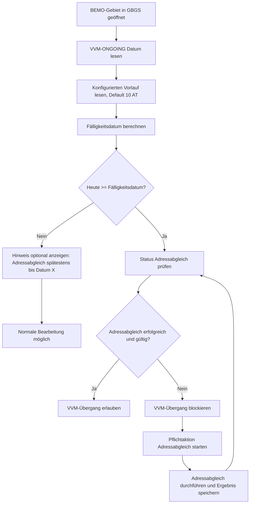
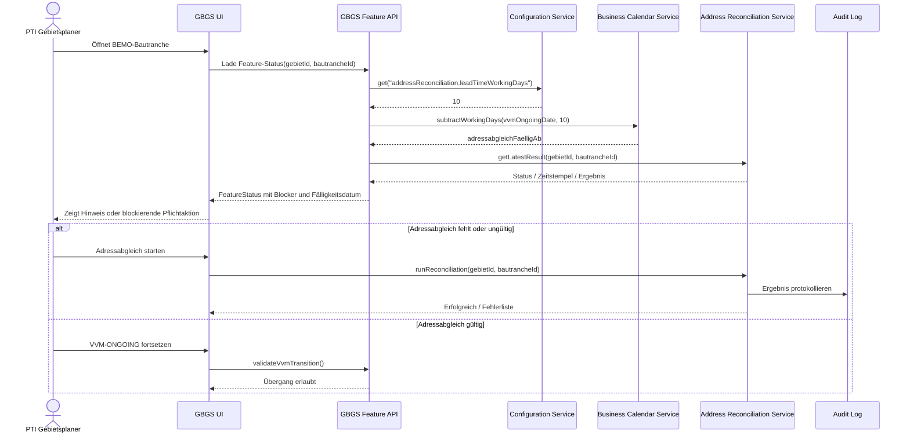
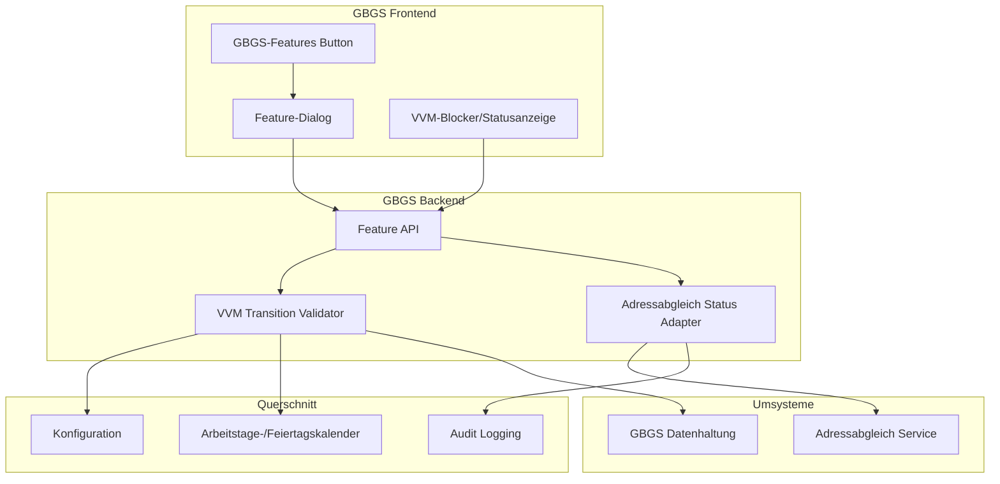

# Solutiondesign: GBGS-Features für BEMO-Gebiete

## Zielbild

Das Feature `GBGS-Features` erweitert die Bautranchensicht um geführte Aktionen für BEMO-Gebiete. Vor dem Erreichen des Datums `VVM-ONGOING` im GBGS muss ein Adressabgleich erzwungen werden. Der Zeitraum ist konfigurierbar, zum Beispiel `10 Arbeitstage vor VVM-ONGOING`.

## Neue fachliche Anforderung

Vor `VVM-ONGOING` wird ein Pflichtfenster für den Adressabgleich berechnet:

```text
adressabgleichFaelligAb = VVM_ONGOING - konfigurierterVorlaufInArbeitstagen
```

Standardwert:

```text
konfigurierterVorlaufInArbeitstagen = 10 AT
```

Regeln:

- `AT` bedeutet Arbeitstage; Wochenenden werden nicht gezählt.
- Feiertage sollen über einen Kalenderdienst oder eine konfigurierbare Feiertagsliste berücksichtigt werden.
- Ab `adressabgleichFaelligAb` darf der Nutzer den VVM-Übergang nicht ohne erfolgreichen Adressabgleich abschließen.
- Ist kein gültiger Adressabgleich vorhanden, zeigt GBGS eine blockierende Aktion mit Link/Start in den Adressabgleich.
- Ein erfolgreicher Adressabgleich wird revisionssicher am Gebiet bzw. an der Bautranche gespeichert.
- Der Vorlauf ist mandanten- oder systemweit konfigurierbar und initial auf `10 AT` gesetzt.

## UML: Use Case


## UML: Aktivitätsdiagramm



## UML: Sequenzdiagramm



## UML: Komponenten



## Schnittstellenentwurf

### Feature-Status laden

```http
GET /api/gbgs/features/status?gebietId={gebietId}&bautrancheId={bautrancheId}
```

Antwort:

```json
{
  "gebietId": "BEMO_1312200021",
  "bautrancheId": "1428",
  "vvmOngoingDate": "2026-08-19",
  "leadTimeWorkingDays": 10,
  "addressReconciliationDueFrom": "2026-08-05",
  "addressReconciliationStatus": "MISSING",
  "vvmTransitionBlocked": true,
  "blockingReason": "Adressabgleich erforderlich"
}
```

### VVM-Übergang validieren

```http
POST /api/gbgs/vvm-transition/validate
```

Payload:

```json
{
  "gebietId": "BEMO_1312200021",
  "bautrancheId": "1428",
  "targetState": "VVM_ONGOING"
}
```

## Konfiguration

| Key | Default | Beschreibung |
| --- | ---: | --- |
| `addressReconciliation.leadTimeWorkingDays` | `10` | Anzahl Arbeitstage vor `VVM-ONGOING`, ab der der Adressabgleich verpflichtend ist |
| `addressReconciliation.validityDays` | `30` | Zeitraum, in dem ein bereits erfolgreicher Abgleich als gültig gilt |
| `businessCalendar.region` | `DE` | Kalenderregion für Wochenenden und Feiertage |
| `addressReconciliation.blockTransition` | `true` | Erzwingt Blockade des VVM-Übergangs bei fehlendem/ungültigem Abgleich |

## Jira-Tickets und Arbeitspakete

### GBGS-101: Konfiguration für Adressabgleich-Vorlauf bereitstellen

Komponente: Configuration Service / GBGS Backend

Beschreibung:
Als System möchte ich den Vorlauf für den verpflichtenden Adressabgleich in Arbeitstagen konfigurieren können, damit die Fachseite den Zeitraum ohne Codeänderung anpassen kann.

Akzeptanzkriterien:

- Config-Key `addressReconciliation.leadTimeWorkingDays` ist verfügbar.
- Defaultwert ist `10`.
- Ungültige Werte kleiner `0` werden abgewiesen.
- Änderungen sind ohne Deployment wirksam, sofern die bestehende Plattform dies unterstützt.

### GBGS-102: Arbeitstagsberechnung inklusive Feiertagskalender integrieren

Komponente: GBGS Backend / Calendar Service

Beschreibung:
Der Backend-Service berechnet das Fälligkeitsdatum für den Adressabgleich aus `VVM-ONGOING` minus konfigurierten Arbeitstagen.

Akzeptanzkriterien:

- Wochenenden werden nicht als Arbeitstage gezählt.
- Feiertage werden über Kalenderregion `DE` berücksichtigt.
- Berechnung ist deterministisch und unit-getestet.
- Beispiel: `VVM-ONGOING` und `10 AT` liefern ein korrekt berechnetes `addressReconciliationDueFrom`.

### GBGS-103: Adressabgleich-Statusmodell erweitern

Komponente: GBGS Datenmodell / Persistence

Beschreibung:
GBGS speichert pro Gebiet/Bautranche den Status des letzten Adressabgleichs inklusive Ergebnis, Zeitstempel und ausführendem Nutzer/System.

Akzeptanzkriterien:

- Statuswerte mindestens: `MISSING`, `IN_PROGRESS`, `SUCCESS`, `FAILED`, `EXPIRED`.
- Zeitstempel, Ergebnisreferenz und Nutzer/System werden gespeichert.
- Migration ist rückwärtskompatibel für bestehende Gebiete.
- Audit-Anforderungen sind mit Security/Compliance abgestimmt.

### GBGS-104: Adapter zum Adressabgleich-Service implementieren

Komponente: GBGS Backend / Integration

Beschreibung:
GBGS kann den Adressabgleich starten und den letzten Status abrufen.

Akzeptanzkriterien:

- API-Client für Start und Statusabfrage ist implementiert.
- Fehler aus dem Umsystem werden fachlich verständlich gemappt.
- Timeouts und Retries sind definiert.
- Integrationstests mit Mock-Service sind vorhanden.

### GBGS-105: VVM-Transition-Validator erzwingt Adressabgleich

Komponente: GBGS Backend / VVM Workflow

Beschreibung:
Vor dem Zustandswechsel nach `VVM-ONGOING` prüft GBGS, ob der Adressabgleich im Pflichtfenster erfolgreich abgeschlossen wurde.

Akzeptanzkriterien:

- Ab `addressReconciliationDueFrom` blockiert ein fehlender, fehlgeschlagener oder abgelaufener Adressabgleich den Übergang.
- Vor dem Pflichtfenster wird nicht blockiert.
- Bei Blockade wird ein eindeutiger Fehlercode zurückgegeben.
- Backend-Validierung greift unabhängig vom Frontend.

### GBGS-106: Feature-Status-API für Frontend bereitstellen

Komponente: GBGS Backend / REST API

Beschreibung:
Das Frontend erhält den berechneten Feature-Status für eine Bautranche, inklusive Fälligkeitsdatum, Status und Blockadegrund.

Akzeptanzkriterien:

- Endpoint `GET /api/gbgs/features/status` liefert alle für die UI nötigen Felder.
- Berechtigungsprüfung entspricht der bestehenden GBGS-Berechtigungslogik.
- Antwortzeiten sind für die Bautranchensicht geeignet.
- API-Kontrakt ist dokumentiert.

### GBGS-107: UI-Erweiterung `GBGS-Features` in Bautranchensicht

Komponente: GBGS Frontend

Beschreibung:
In der Bautranchensicht wird ein Button `GBGS-Features` angezeigt, der den Feature-Dialog öffnet.

Akzeptanzkriterien:

- Button ist in der Bautranchen-Tabansicht sichtbar.
- Dialog zeigt `GBGS - Gebiet anlegen` und `VVM-Importliste erzeugen`.
- Status zum Adressabgleich wird im Dialog angezeigt.
- UI folgt dem bestehenden GBGS-Styling.

### GBGS-108: Blockierende UI-Aktion für verpflichtenden Adressabgleich

Komponente: GBGS Frontend

Beschreibung:
Wenn der Adressabgleich verpflichtend ist und noch nicht erfolgreich abgeschlossen wurde, zeigt die UI eine blockierende Pflichtaktion.

Akzeptanzkriterien:

- Hinweis enthält Fälligkeitsdatum und Grund.
- Nutzer kann den Adressabgleich aus der UI starten.
- VVM-Übergang ist im Frontend sichtbar blockiert.
- Nach erfolgreichem Abgleich aktualisiert sich der Status ohne vollständigen Seitenwechsel.

### GBGS-109: Audit Logging für Adressabgleich und Blockadeentscheidungen

Komponente: Audit / Compliance

Beschreibung:
Alle relevanten Aktionen und Systementscheidungen werden revisionssicher protokolliert.

Akzeptanzkriterien:

- Start, Erfolg, Fehler und Abbruch des Adressabgleichs werden protokolliert.
- Blockierte VVM-Übergänge werden mit Grund protokolliert.
- Logs enthalten Gebiet, Bautranche, Nutzer/System, Zeitstempel und Korrelations-ID.
- Personenbezogene Daten werden nur im erforderlichen Umfang gespeichert.

### GBGS-110: End-to-End Tests für VVM-ONGOING Blockade

Komponente: QA / Test Automation

Beschreibung:
Automatisierte Tests sichern die fachliche Regel rund um `VVM-ONGOING` und den konfigurierbaren Vorlauf ab.

Akzeptanzkriterien:

- Testfall: vor Pflichtfenster keine Blockade.
- Testfall: im Pflichtfenster ohne Abgleich Blockade.
- Testfall: im Pflichtfenster mit erfolgreichem Abgleich keine Blockade.
- Testfall: geänderter Vorlauf, zum Beispiel `5 AT`, wirkt korrekt.
- Testfall: Wochenenden/Feiertage in der Arbeitstagsberechnung.

## Offene Klärungen

- Welche Kalenderregion gilt bei BEMO verbindlich: bundesweit `DE` oder regional nach Gebiet/Bundesland?
- Wie lange bleibt ein erfolgreicher Adressabgleich gültig?
- Gibt es bereits einen produktiven Adressabgleich-Service oder muss dieser neu gebaut werden?
- Soll die Blockade nur für BEMO oder für alle Gebietstypen gelten?
- Wer darf die Vorlauf-Konfiguration ändern?
