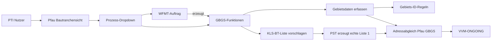
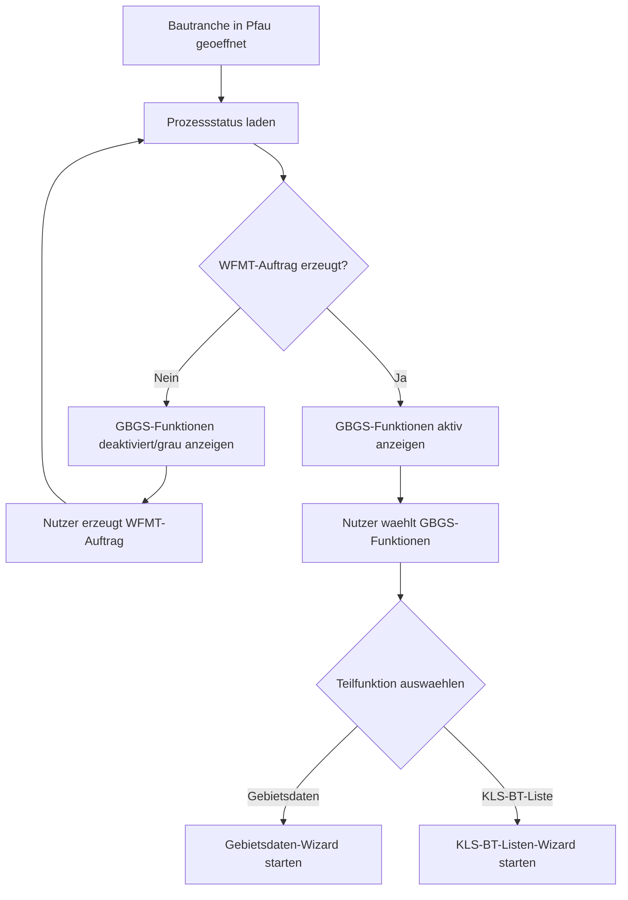
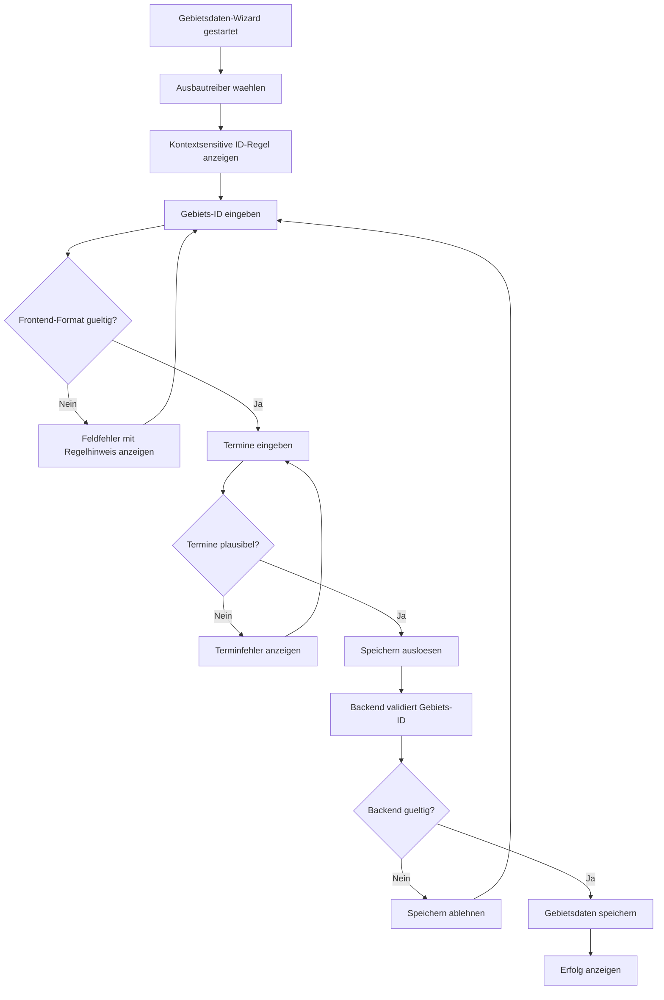
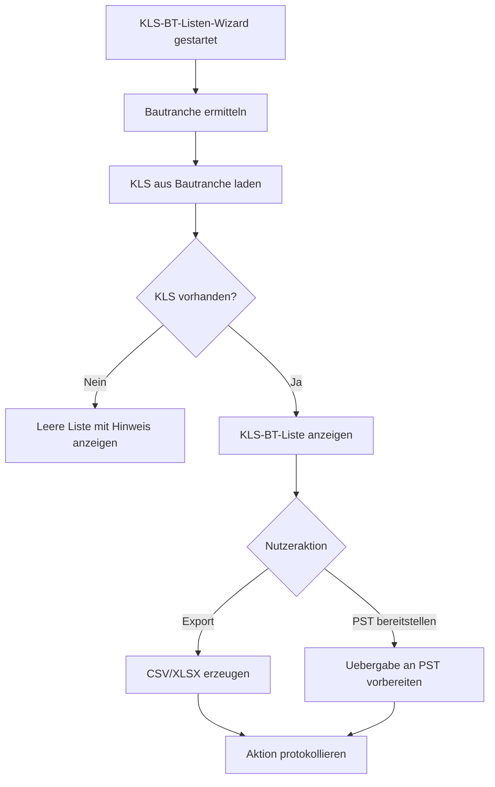
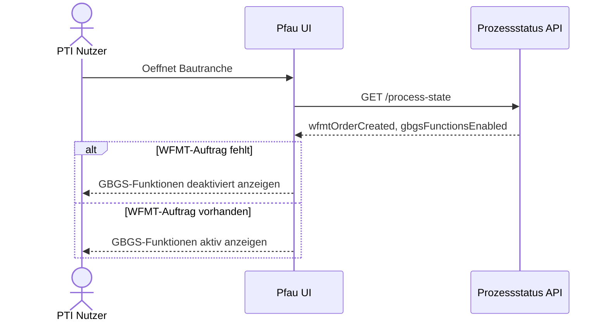
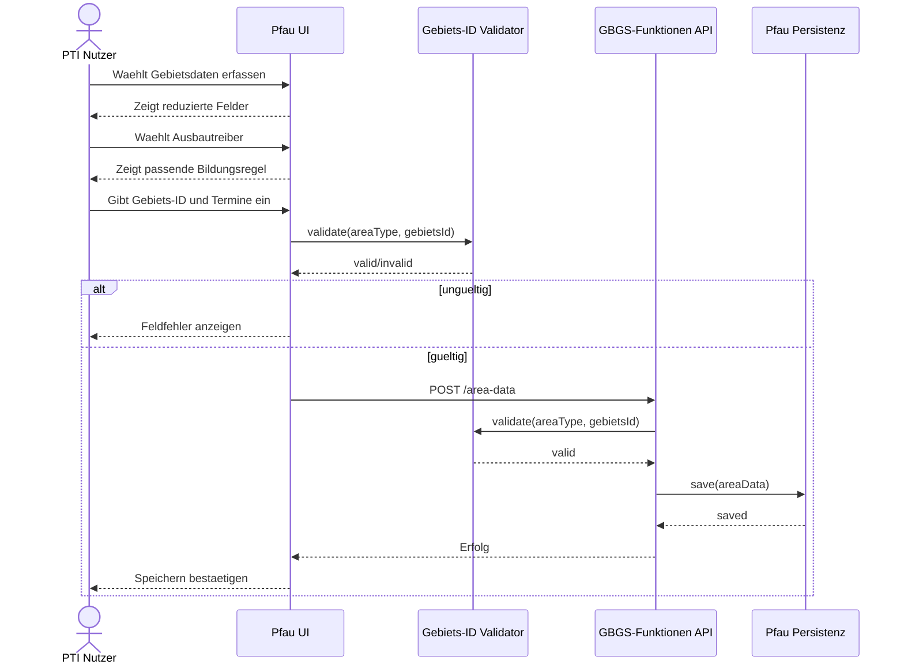
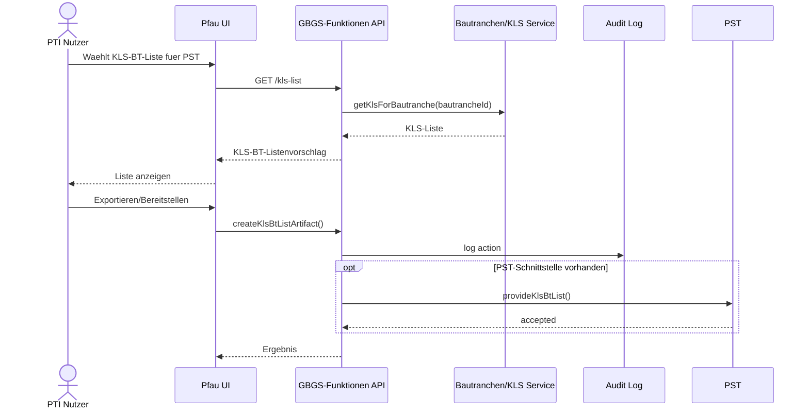
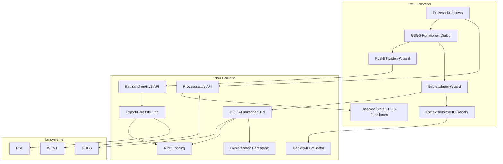
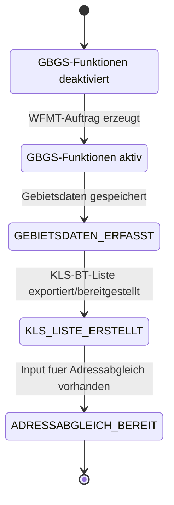

# UML: Adressabgleich Pfau GBGS

Diese Datei enthaelt die aktualisierten UML-/Mermaid-Diagramme fuer den Use Case `Adressabgleich Pfau GBGS`.

## Use Case Diagramm

## Aktivitaetsdiagramm: Einstieg und Funktionsauswahl

## Aktivitaetsdiagramm: Gebietsdaten

## Aktivitaetsdiagramm: KLS-BT-Liste

## Sequenzdiagramm: Prozess-Dropdown

## Sequenzdiagramm: Gebietsdaten speichern

## Sequenzdiagramm: KLS-BT-Liste

## Komponentendiagramm

## Statusmodell

