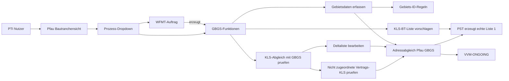

# Use Case Diagramm

Quelle: Kapitel 13 Solutiondesign `Adressabgleich Pfau GBGS`.

```mermaid
flowchart LR
  User["PTI Nutzer"]
  Pfau["Pfau Bautranchensicht"]
  ProcessMenu["Prozess-Dropdown"]
  Wfmt["WFMT-Auftrag"]
  GbgsFunctions["GBGS-Funktionen"]
  AreaWizard["Gebietsdaten erfassen"]
  IdRules["Gebiets-ID-Regeln"]
  KlsWizard["KLS-BT-Liste vorschlagen"]
  DeltaGui["KLS-Abgleich mit GBGS pruefen"]
  DeltaList["Deltaliste bearbeiten"]
  Unassigned["Nicht zugeordnete Vertrags-KLS pruefen"]
  Pst["PST erzeugt echte Liste 1"]
  Reconcile["Adressabgleich Pfau GBGS"]
  Vvm["VVM-ONGOING"]

  User --> Pfau
  Pfau --> ProcessMenu
  ProcessMenu --> Wfmt
  Wfmt -->|"erzeugt"| GbgsFunctions
  ProcessMenu --> GbgsFunctions
  GbgsFunctions --> AreaWizard
  AreaWizard --> IdRules
  GbgsFunctions --> KlsWizard
  GbgsFunctions --> DeltaGui
  DeltaGui --> DeltaList
  DeltaGui --> Unassigned
  KlsWizard --> Pst
  AreaWizard --> Reconcile
  DeltaList --> Reconcile
  Unassigned --> Reconcile
  Reconcile --> Pst
  Reconcile --> Vvm
```
