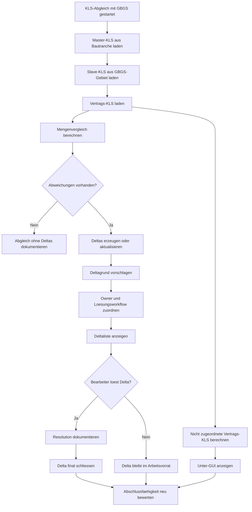

# Aktivitaetsdiagramm: KLS-Abgleich und Deltafuehrung

Quelle: Kapitel 13 Solutiondesign `Adressabgleich Pfau GBGS`.

```mermaid
flowchart TD
  A["KLS-Abgleich mit GBGS gestartet"] --> B["Master-KLS aus Bautranche laden"]
  B --> C["Slave-KLS aus GBGS-Gebiet laden"]
  C --> D["Vertrags-KLS laden"]
  D --> E["Mengenvergleich berechnen"]
  E --> F{"Abweichungen vorhanden?"}
  F -- "Nein" --> G["Abgleich ohne Deltas dokumentieren"]
  F -- "Ja" --> H["Deltas erzeugen oder aktualisieren"]
  H --> I["Deltagrund vorschlagen"]
  I --> J["Owner und Loesungsworkflow zuordnen"]
  J --> K["Deltaliste anzeigen"]
  D --> L["Nicht zugeordnete Vertrags-KLS berechnen"]
  L --> M["Unter-GUI anzeigen"]
  K --> N{"Bearbeiter loest Delta?"}
  N -- "Ja" --> O["Resolution dokumentieren"]
  O --> P["Delta final schliessen"]
  N -- "Nein" --> Q["Delta bleibt im Arbeitsvorrat"]
  P --> R["Abschlussfaehigkeit neu bewerten"]
  Q --> R
  M --> R
```
