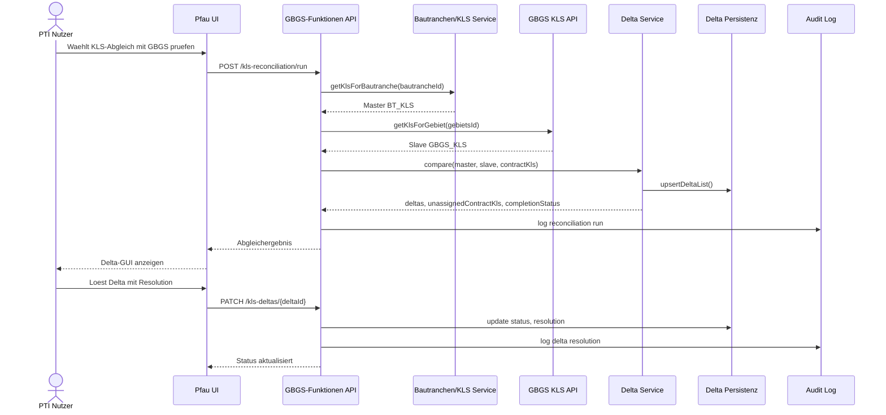

# Sequenzdiagramm: KLS-Abgleich

Quelle: Kapitel 13 Solutiondesign `Adressabgleich Pfau GBGS`.

```mermaid
sequenceDiagram
  actor User as PTI Nutzer
  participant UI as Pfau UI
  participant API as GBGS-Funktionen API
  participant BT as Bautranchen/KLS Service
  participant GBGS as GBGS KLS API
  participant DELTA as Delta Service
  participant DB as Delta Persistenz
  participant AUD as Audit Log

  User->>UI: Waehlt KLS-Abgleich mit GBGS pruefen
  UI->>API: POST /kls-reconciliation/run
  API->>BT: getKlsForBautranche(bautrancheId)
  BT-->>API: Master BT_KLS
  API->>GBGS: getKlsForGebiet(gebietsId)
  GBGS-->>API: Slave GBGS_KLS
  API->>DELTA: compare(master, slave, contractKls)
  DELTA->>DB: upsertDeltaList()
  DELTA-->>API: deltas, unassignedContractKls, completionStatus
  API->>AUD: log reconciliation run
  API-->>UI: Abgleichergebnis
  UI-->>User: Delta-GUI anzeigen

  User->>UI: Loest Delta mit Resolution
  UI->>API: PATCH /kls-deltas/{deltaId}
  API->>DB: update status, resolution
  API->>AUD: log delta resolution
  API-->>UI: Status aktualisiert
```
