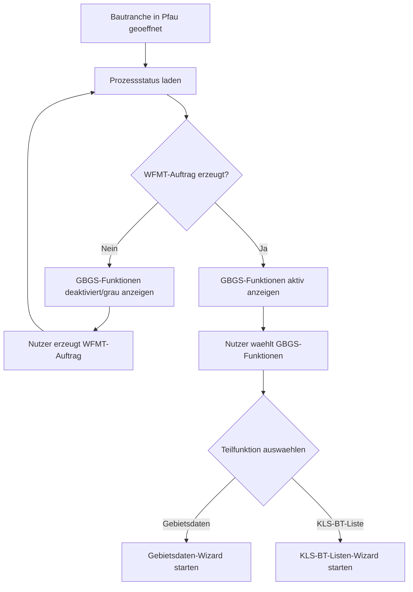

# Aktivitaetsdiagramm Einstieg und Funktionsauswahl

Quelle: Kapitel 13 Solutiondesign `Adressabgleich Pfau GBGS`.

```mermaid
flowchart TD
  A["Bautranche in Pfau geoeffnet"] --> B["Prozessstatus laden"]
  B --> C{"WFMT-Auftrag erzeugt?"}
  C -- "Nein" --> D["GBGS-Funktionen deaktiviert/grau anzeigen"]
  D --> E["Nutzer erzeugt WFMT-Auftrag"]
  E --> B
  C -- "Ja" --> F["GBGS-Funktionen aktiv anzeigen"]
  F --> G["Nutzer waehlt GBGS-Funktionen"]
  G --> H{"Teilfunktion auswaehlen"}
  H -- "Gebietsdaten" --> I["Gebietsdaten-Wizard starten"]
  H -- "KLS-BT-Liste" --> J["KLS-BT-Listen-Wizard starten"]
```
