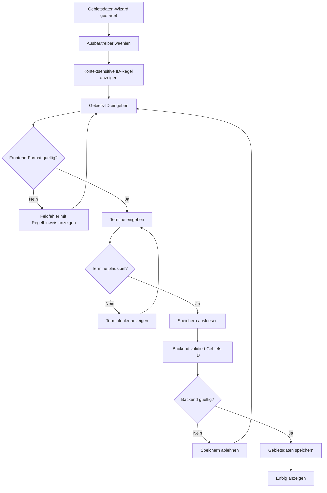

# Aktivitaetsdiagramm Gebietsdaten

Quelle: Kapitel 13 Solutiondesign `Adressabgleich Pfau GBGS`.

```mermaid
flowchart TD
  A["Gebietsdaten-Wizard gestartet"] --> B["Ausbautreiber waehlen"]
  B --> C["Kontextsensitive ID-Regel anzeigen"]
  C --> D["Gebiets-ID eingeben"]
  D --> E{"Frontend-Format gueltig?"}
  E -- "Nein" --> F["Feldfehler mit Regelhinweis anzeigen"]
  F --> D
  E -- "Ja" --> G["Termine eingeben"]
  G --> H{"Termine plausibel?"}
  H -- "Nein" --> I["Terminfehler anzeigen"]
  I --> G
  H -- "Ja" --> J["Speichern ausloesen"]
  J --> K["Backend validiert Gebiets-ID"]
  K --> L{"Backend gueltig?"}
  L -- "Nein" --> M["Speichern ablehnen"]
  M --> D
  L -- "Ja" --> N["Gebietsdaten speichern"]
  N --> O["Erfolg anzeigen"]
```
