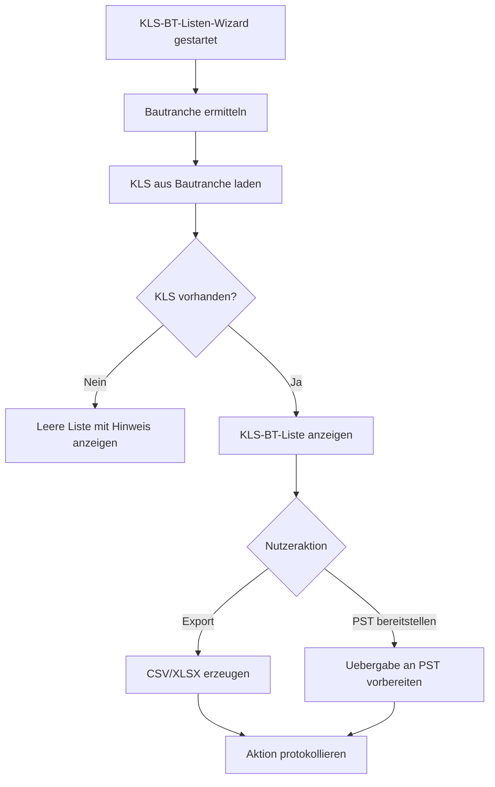

# Aktivitaetsdiagramm KLS-BT-Liste

Quelle: Kapitel 13 Solutiondesign `Adressabgleich Pfau GBGS`.

```mermaid
flowchart TD
  A["KLS-BT-Listen-Wizard gestartet"] --> B["Bautranche ermitteln"]
  B --> C["KLS aus Bautranche laden"]
  C --> D{"KLS vorhanden?"}
  D -- "Nein" --> E["Leere Liste mit Hinweis anzeigen"]
  D -- "Ja" --> F["KLS-BT-Liste anzeigen"]
  F --> G{"Nutzeraktion"}
  G -- "Export" --> H["CSV/XLSX erzeugen"]
  G -- "PST bereitstellen" --> I["Uebergabe an PST vorbereiten"]
  H --> J["Aktion protokollieren"]
  I --> J
```
