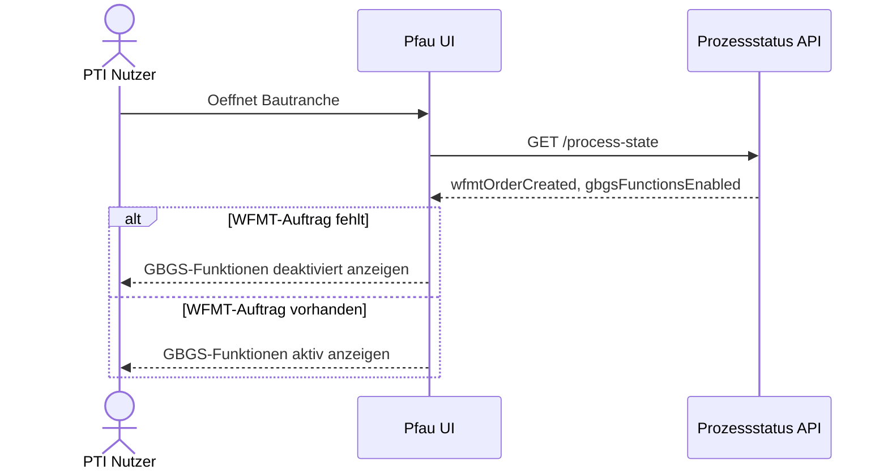

# Sequenzdiagramm Prozess-Dropdown

Quelle: Kapitel 13 Solutiondesign `Adressabgleich Pfau GBGS`.

```mermaid
sequenceDiagram
  actor User as PTI Nutzer
  participant UI as Pfau UI
  participant PROC as Prozessstatus API

  User->>UI: Oeffnet Bautranche
  UI->>PROC: GET /process-state
  PROC-->>UI: wfmtOrderCreated, gbgsFunctionsEnabled
  alt WFMT-Auftrag fehlt
    UI-->>User: GBGS-Funktionen deaktiviert anzeigen
  else WFMT-Auftrag vorhanden
    UI-->>User: GBGS-Funktionen aktiv anzeigen
  end
```
