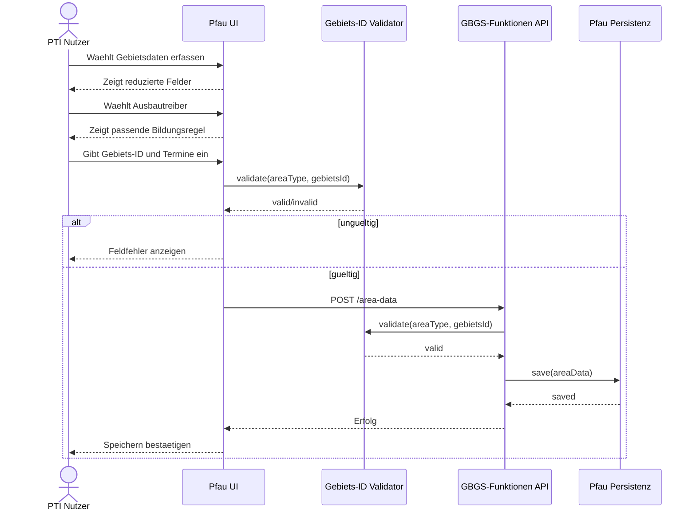

# Sequenzdiagramm Gebietsdaten speichern

Quelle: Kapitel 13 Solutiondesign `Adressabgleich Pfau GBGS`.

```mermaid
sequenceDiagram
  actor User as PTI Nutzer
  participant UI as Pfau UI
  participant VAL as Gebiets-ID Validator
  participant API as GBGS-Funktionen API
  participant DB as Pfau Persistenz

  User->>UI: Waehlt Gebietsdaten erfassen
  UI-->>User: Zeigt reduzierte Felder
  User->>UI: Waehlt Ausbautreiber
  UI-->>User: Zeigt passende Bildungsregel
  User->>UI: Gibt Gebiets-ID und Termine ein
  UI->>VAL: validate(areaType, gebietsId)
  VAL-->>UI: valid/invalid
  alt ungueltig
    UI-->>User: Feldfehler anzeigen
  else gueltig
    UI->>API: POST /area-data
    API->>VAL: validate(areaType, gebietsId)
    VAL-->>API: valid
    API->>DB: save(areaData)
    DB-->>API: saved
    API-->>UI: Erfolg
    UI-->>User: Speichern bestaetigen
  end
```
