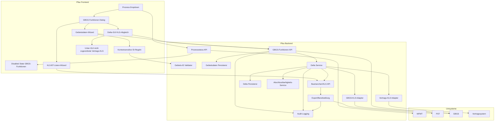

# Komponentendiagramm

Quelle: Kapitel 13 Solutiondesign `Adressabgleich Pfau GBGS`.

```mermaid
flowchart TB
  subgraph Frontend["Pfau Frontend"]
    PD["Prozess-Dropdown"]
    DIS["Disabled State GBGS-Funktionen"]
    MOD["GBGS-Funktionen Dialog"]
    AREA["Gebietsdaten-Wizard"]
    RULE["Kontextsensitive ID-Regeln"]
    KLSUI["KLS-BT-Listen-Wizard"]
    DELTAUI["Delta-GUI KLS-Abgleich"]
    UNASSIGNEDUI["Unter-GUI nicht zugeordnete Vertrags-KLS"]
  end

  subgraph Backend["Pfau Backend"]
    PROC["Prozessstatus API"]
    FAPI["GBGS-Funktionen API"]
    VALID["Gebiets-ID Validator"]
    DATA["Gebietsdaten Persistenz"]
    KLSAPI["Bautranchen/KLS API"]
    GBGSKLS["GBGS-KLS Adapter"]
    DELTASVC["Delta Service"]
    DELTADB["Delta Persistenz"]
    CONTRACT["Vertrags-KLS Adapter"]
    COMPLETE["Abschlussfaehigkeits-Service"]
    EXPORT["Export/Bereitstellung"]
    AUD["Audit Logging"]
  end

  subgraph External["Umsysteme"]
    WFMT["WFMT"]
    PST["PST"]
    GBGS["GBGS"]
    CONTRACTSYS["Vertragssystem"]
  end

  PD --> PROC
  PROC --> WFMT
  PROC --> DIS
  PD --> MOD
  MOD --> AREA
  AREA --> RULE
  RULE --> VALID
  AREA --> FAPI
  FAPI --> DATA
  MOD --> KLSUI
  KLSUI --> KLSAPI
  MOD --> DELTAUI
  DELTAUI --> FAPI
  DELTAUI --> UNASSIGNEDUI
  KLSAPI --> EXPORT
  EXPORT --> PST
  FAPI --> DELTASVC
  DELTASVC --> KLSAPI
  DELTASVC --> GBGSKLS
  DELTASVC --> CONTRACT
  DELTASVC --> DELTADB
  DELTASVC --> COMPLETE
  GBGSKLS --> GBGS
  CONTRACT --> CONTRACTSYS
  FAPI --> AUD
  DELTASVC --> AUD
  EXPORT --> AUD
  FAPI --> GBGS
```
